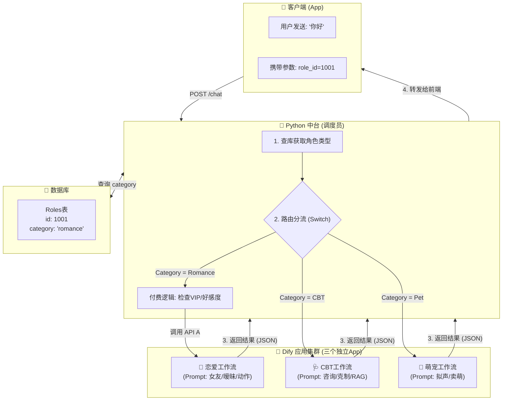
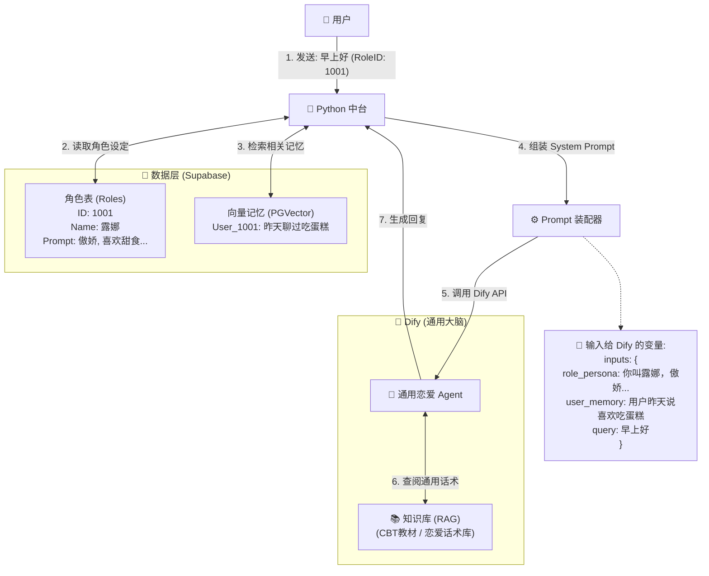
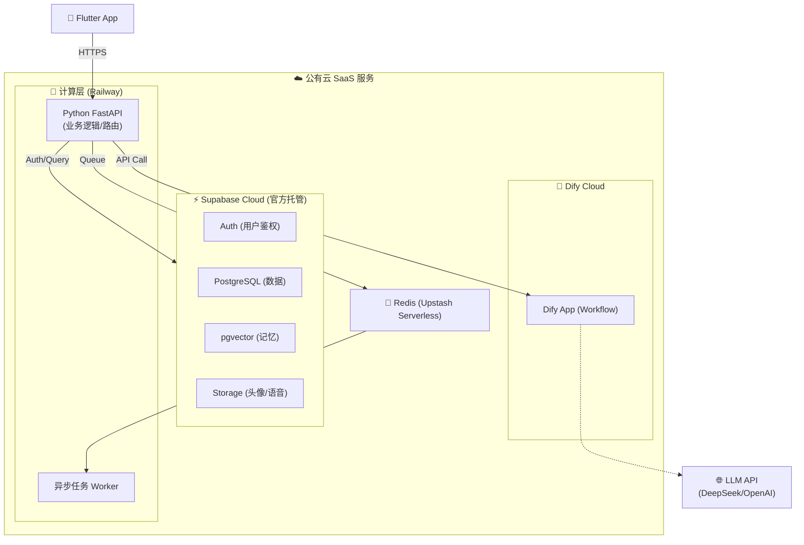
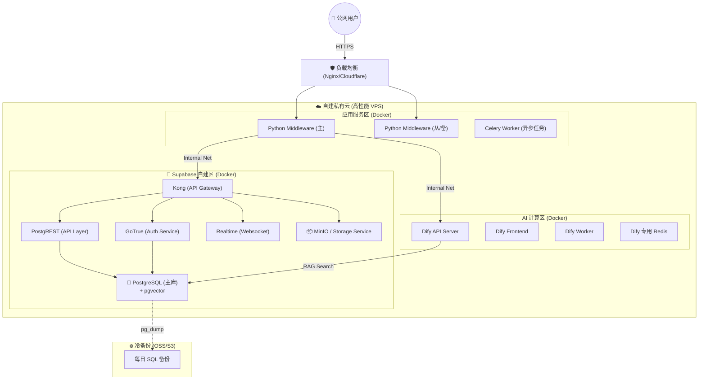

1. 总体架构视图
本系统采用端云分离 + BaaS (Backend as a Service) + AI 中台 的混合架构。

1.1 系统架构图
暂时无法在飞书文档外展示此内容

1.2 架构层级深度解析

1.2.1 接入层 - "大门与保安"
- CDN / Load Balancer：
  - 作用：App 的静态资源（如 Live2D 模型文件、生成的头像图片、语音文件）通过 CDN 加速，确保用户加载不卡顿。
- Supabase / API Gateway：
  - Auth 鉴权：利用 Supabase Auth 处理注册/登录，生成 JWT Token。没有 Token 的请求直接拒之门外。
  - 安全风控 (Crisis Check)：（建议优化点） 第一道防线，拦截恶意攻击和高危敏感词。
  - 流量控制 (Rate Limit)：防止某个用户狂刷接口烧光你的 LLM 额度。
  - 埋点日志：记录谁在什么时候调了什么接口，方便排查 Bug。

1.2.2 应用层 - "门面与控制台"

- Flutter Mobile Client (用户端)：
  - 聊天会话：核心界面，展示气泡流。
  - Live2D 渲染引擎：这是 App 的“灵魂”。负责加载模型，并根据后端指令播放“摸头”、“害羞”等动画。
  - 角色捏脸：对应“角色唤醒系统”，上传照片 -> 生成头像。
  - 沉浸模式：一个开关，控制 Live2D 层是否显示。
  - 本地状态管理：(Bloc/Riverpod) 缓存聊天记录，保证没网也能看历史消息。
- Admin Web (运营端)：
  - 用户/会员管理：查看谁充了 VIP，处理退款。
  - 角色配置：产品经理在这里录入 160 个角色的 Prompt 和设定，不需要改代码。

1.2.3 领域层  - "AI 中台大脑" (核心!)

这是 Python Middleware 的内部逻辑划分。
- Interaction Service (交互服务)：
  - Router (意图路由)：判断用户意图。是去 CBT 轨、恋爱轨 还是 萌宠轨？
  - Action Protocol (动作解析)：把 LLM 输出的文本（如 (脸红) 讨厌！）翻译成前端能懂的代码 { "motion": "shy", "text": "讨厌！" }。
- Persona Service (人格服务)：
  - Prompt Assembler：动态拼装工。比如：基础Prompt + 御姐设定 + 记忆片段 = 最终发给LLM的Prompt。
  - Tri-Track Logic：执行“三轨制”的业务规则（比如：萌宠模式下禁止发送色情内容）。
- Memory Service (记忆服务)：
  - RAG Engine：去向量库里找，“用户以前说过什么相关的话？”
  - Summary Engine：每天晚上自动总结，“今天聊了什么”，存入长期记忆。
  - Relation Manager：管理好感度数值，判断是否升级为“恋人”。

1.2.4 基建层  - "底座与外援"

- AI Middleware & Model Services：
  - Dify：你的 LLM 编排工具，负责管理复杂的 Prompt 链。
  - LLM API：实际的大脑（DeepSeek 便宜聪明，GPT-4o 贵但强）。
  - GenAI：Stable Diffusion，负责“照片转二次元头像”。
  - TTS / ASR：语音转文字、文字转语音服务。
- Common Storage (Supabase)：
  - PostgreSQL：存用户表、角色表、订单表。
  - PGVector：存记忆的向量数据（让 AI 有记忆）。
  - Object Store：存图片和语音文件。
  
2. 逻辑架构图
设计理念：分层解耦。客户端只负责“演”，AI 中台负责“导”，Dify 负责“编”，BaaS 负责“存”。

配置项	💖 恋爱工作流 (App A)	🩺 CBT 工作流 (App B)	🐾 萌宠工作流 (App C)
System Prompt 核心	“你是用户的恋人。你要根据好感度决定亲密程度。多用动作描写。”	“你是专业的心理咨询师。运用苏格拉底提问法。严禁建立恋爱关系。”	“你是[物种]。你智商不高，说话简单，喜欢撒娇和吃东西。”
知识库 (RAG)	恋爱话术库 (情话/梗)	心理学教科书 (CBT手册/急救指南)	无 (或宠物习性库)
输入变量	"intimacy_level (好感度)
relationship_stage (关系)"	user_mood (用户情绪标签)	feed_status (饥饿度)
敏感词拦截	宽松 (VIP模式下允许擦边)	极严 (任何色情/暴力直接阻断)	极严 (任何复杂/成人话题装傻)
模型选择	Grok4	deepseekv3	deepseekv3

2.1 Python中台与dify的关系架构

3. 部署架构
3.1 MVP架构
1. 核心策略：速度优先，运维为零，成本极低。 适用场景：0 - 10,000 用户，验证商业模式（三轨制、付费率）。

组件	选型	规格	预估成本	运维工作
数据库/Auth	Supabase Cloud	Free Tier (500MB DB)	$0	0 (全托管)
后端代码	Railway / Render	Hobby Plan	$5	极低 (Git 推送即部署)
AI 编排	Dify Cloud	Sandbox/Pro	$0 - $59	0 (SaaS)
异步队列	Upstash Redis	Free Tier	$0	0 (Serverless)
图片存储	Supabase Storage	包含在 Free Tier	$0	0
总计			<$10 /月	专注于写代码

3.2 规模化扩张期架构
核心策略：数据主权，成本可控，高性能。 适用场景：用户量 > 5万，或开始产生大量隐私数据，且 SaaS 费用开始变得昂贵时。 关键动作：租赁高性能 VPS，使用 Docker Compose 部署全套私有化服务。

组件	建议配置	用途	预估成本	运维要点
主服务器	8核 16G内存 200G SSD	运行 Supabase 全家桶 + Dify + Python	$30 - $60	需熟悉 Docker Compose
对象存储	AWS S3 / 阿里云 OSS	替代本地 MinIO 存图片 (更稳)	按量	配置 CDN 加速
备份服务	轻量级 VPS 或 S3	异地备份 SQL 文件	$5	编写 Shell 脚本
总计			~$50 /月	需专人负责系统安全与更新

---

4. 核心技术选型矩阵
组件	建议配置	用途	预估成本	运维要点
主服务器	8核 16G内存 200G SSD	运行 Supabase 全家桶 + Dify + Python	$30 - $60	需熟悉 Docker Compose
对象存储	AWS S3 / 阿里云 OSS	替代本地 MinIO 存图片 (更稳)	按量	配置 CDN 加速
备份服务	轻量级 VPS 或 S3	异地备份 SQL 文件	$5	编写 Shell 脚本
总计			~$50 /月	需专人负责系统安全与更新

---
5. 从 MVP 到 Scale 的迁移指南
1. 代码层解耦 (Day 1)：
  - 所有 API 地址（Supabase URL, Dify URL）必须通过环境变量 (.env) 读取。
  - 文件存储封装一层 FileService，不要在业务逻辑里直接写死 S3 或 OSS 的 SDK。
2. 数据迁移 (D-Day)：
  - 使用 pg_dump 从 Supabase/MemFire 导出全量 SQL。
  - 在 VPS 的 Docker Postgres 中执行恢复。
  - 切换 DNS 解析，将 API 域名指向新服务器 IP。
3. 双轨运行 (热备)：
  - 保留 SaaS 环境作为“灾备”。如果 VPS 挂了，Python 中间件一键切回 SaaS 配置，保证 App 不宕机。

---
6. 团队下一步行动
- 后端：基于“MVP 架构”图，去注册 MemFire Cloud (或 Supabase) 和 Railway，先把 Hello World 跑通。
- 前端：专注于 Flutter + Live2D 的交互实现，数据接口暂时用 Mock 数据。
- AI：在 Dify 上调试“恋爱/CBT/萌宠”三个 Agent 的 Prompt，确保逻辑通顺。

