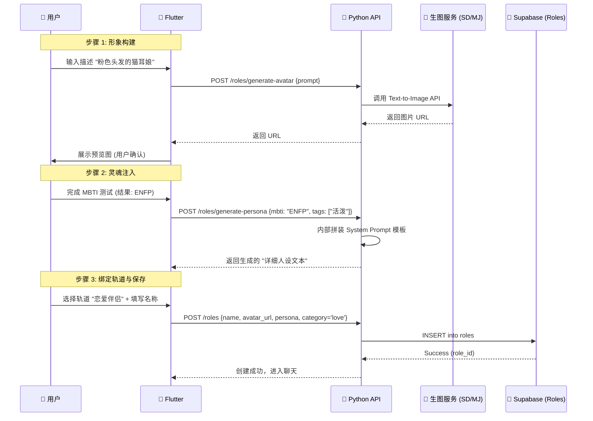
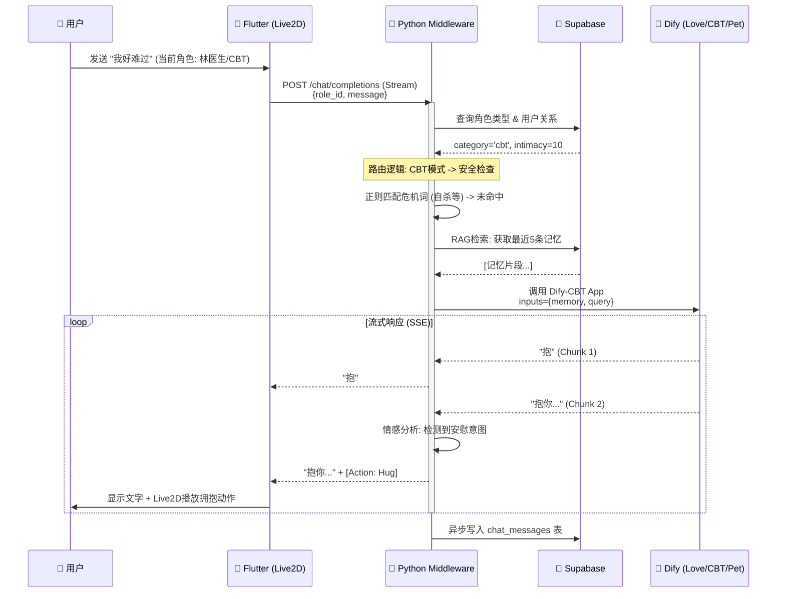
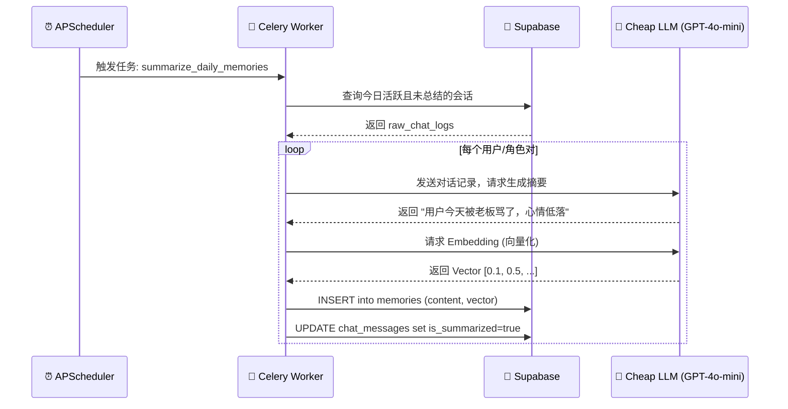

好的，这是进入开发编码前最重要的\*\*《AI伴侣 APP 详细设计说明书 (Detailed Design Document)》\*\*。

这份文档将上一阶段的《系统架构 Canvas》和《技术实施规格书》进一步**颗粒化**，细化到**具体的时序逻辑、数据库字段定义和 API 接口参数**。它将作为后端写代码、前端接接口的直接依据。

-----

# 📘 AI伴侣 APP 详细设计说明书 (MVP版)

**版本**: v1.0
**状态**: 待开发 (Ready for Dev)
**架构基准**: Flutter + Python Middleware + Dify + Supabase

-----

## 1\. 核心业务流程详细设计 (Detailed Business Flows)

### 1.1 角色唤醒（创建）流程

**核心逻辑**：用户通过“AI绘图”生成形象，通过“MBTI测试”生成人设，两者结合存入数据库，不涉及 Dify 动态创建 App。



### 1.2 核心聊天流转 (三轨制路由 + 动作解析)

**核心逻辑**：Python 中台作为“总调度”，负责鉴权、路由、计费、动作指令注入。



### 1.3 异步记忆总结 (定期任务)

**核心逻辑**：不阻塞用户聊天，后台 Celery 慢慢跑。



-----

## 2\. 数据库设计 (Database Schema)

基于 **Supabase (PostgreSQL)**。

### 2.1 `roles` (角色配置表)

| 字段名 | 类型 | 说明 |
| :--- | :--- | :--- |
| `id` | uuid | 主键 |
| `creator_id` | uuid | 创建者ID (NULL为系统角色) |
| `name` | text | 角色名 |
| `avatar_url` | text | 2D立绘图片地址 |
| `category` | enum | **核心字段**: `'love'`, `'cbt'`, `'pet'` |
| `prompt_config` | jsonb | 存储MBTI、口头禅、背景故事。结构：`{"mbti": "INTJ", "bio": "..."}` |
| `safety_level` | int | 风控等级 (1:全年龄, 18:成人) |
| `is_public` | bool | 是否公开可见 |

### 2.2 `user_role_relations` (关系状态表)

| 字段名 | 类型 | 说明 |
| :--- | :--- | :--- |
| `id` | uuid | 主键 |
| `user_id` | uuid | 外键 -\> profiles.id |
| `role_id` | uuid | 外键 -\> roles.id |
| `intimacy_score` | int | 好感度数值 (0-10000) |
| `relationship_stage` | enum | `'stranger'`, `'friend'`, `'crush'`, `'lover'` |
| `last_interact_at` | timestamp | 上次聊天时间 (用于触发主动关怀) |

### 2.3 `memories` (记忆向量表)

| 字段名 | 类型 | 说明 |
| :--- | :--- | :--- |
| `id` | uuid | 主键 |
| `user_id` | uuid | 所属用户 |
| `role_id` | uuid | 所属角色 |
| `content` | text | 记忆摘要文本 |
| `embedding` | vector(1536) | **PGVector 向量数据** |
| `created_at` | timestamp | 记忆形成时间 |

-----

## 3\. API 接口定义 (Interface Definition)

### 3.1 聊天接口 (SSE 流式)

  * **URL**: `POST /api/v1/chat/completions`
  * **Auth**: Bearer Token (Supabase JWT)
  * **Request Body**:
    ```json
    {
      "role_id": "uuid-xxx",
      "message": "今晚我想看点不一样的",
      "mode": "text" // 或 "voice"
    }
    ```
  * **Response (SSE Stream)**:
    ```text
    data: {"type": "text", "content": "那..."}
    data: {"type": "text", "content": "得先关灯哦。"}
    data: {"type": "action", "payload": {"motion": "shy_blush", "voice_url": "http://..."}}
    data: [DONE]
    ```

### 3.2 角色相关接口

  * **创建角色**: `POST /api/v1/roles`
      * Body: `{name, category, prompt_config, ...}`
  * **生成头像**: `POST /api/v1/roles/gen-avatar`
      * Body: `{prompt: "银发御姐"}` -\> Return: `{url: "http://..."}`
  * **查询角色详情**: `GET /api/v1/roles/{id}`
      * Return: 包含 `category` 和当前用户的 `intimacy_score`。

-----

## 4\. 架构一致性自检 (Self-Check)

| 检查项 | 状态 | 说明 |
| :--- | :--- | :--- |
| **是否符合三轨制业务？** | ✅ | 数据库 `category` 字段和 API 路由逻辑已包含此设计。 |
| **是否支持 VIP/双重锁？** | ✅ | 聊天接口流程中包含了 `intimacy` 和 `is_vip` 的检查步骤。 |
| **是否符合 MVP 架构？** | ✅ | 仅依赖 Supabase 和 Dify，Python 只做胶水逻辑，无过度设计。 |
| **是否支持 Live2D？** | ✅ | SSE 协议中专门定义了 `action` 事件用于驱动前端动画。 |
| **是否支持记忆？** | ✅ | 设计了 `memories` 向量表和异步总结 Worker。 |

