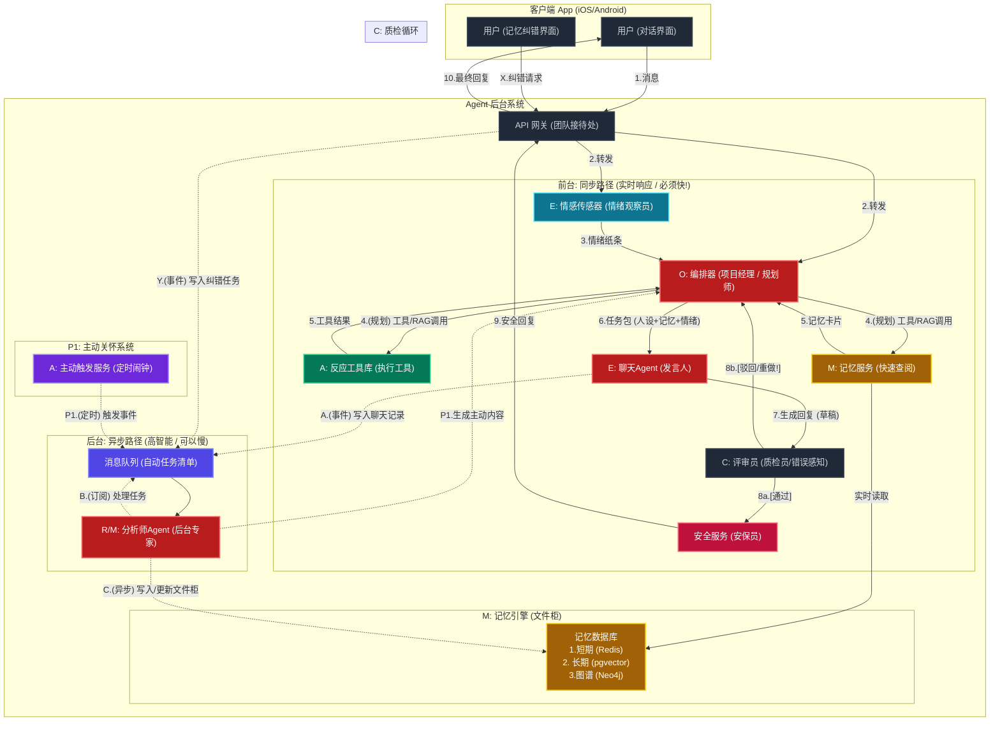

202510311809
Status: #idea
Tags: [[AI伴侣]]

# AI伴侣agent架构&业务流设计-1

---

### 一、 团队成员介绍 (E-M-O-C-R-A 角色拆解)

我们这个团队有“前台”和“后台”：

- **前台 (同步路径):** 负责和用户_实时_沟通，必须快！
- **后台 (异步路径):** 负责_非实时_的重活、累活，可以慢一点，但必须做得好。
    

#### 1. (O) 编排器 (Orchestrator) —— “团队大管家”

- **他的新工作：** 当`O[编排器]`（项目经理）收到一个_复杂_任务时（例如：“提醒我下周五，买我姐姐最爱吃的蛋糕”），他不再是“同时查所有东西”，而是会先**“制定一个计划（Plan）”**。
        
- **(新) 4.0版 Planning (规划)：**
    
    - `O[编排器]` (思考): "这是一个多跳（Multi-Step）任务。我的计划是："
        
        1. **[Tool]** `get_memory(query="姐姐的偏好")`
        2. **[Tool]** `get_memory(query="姐姐的生日")`
        3. **[Tool]** `convert_date(natural_language="下周五")`
        4. **[Tool]** `set_reminder(date=..., content=...)`
        5. **[Route]** `E_Chat(task="告诉用户提醒已设置")`
            
- **对PM的价值：** 这让Agent具备了**“多步推理和执行”**的能力，不再是简单的“一问一答”。他可以处理更复杂的、需要跨工具协作的任务，使Agent的“智能”上限大大提高。

#### 2. (E) 情感传感器 (Emotion Sensor) —— “情绪观察员”

- **他是谁？** `E[情感传感器]` 是个“微表情”专家。
- **他的工作：** 他不关心用户说了_什么_，只关心用户_怎么说_的。他会给“大管家”递纸条，上面写着（P0版）：
    - `{"情绪": "焦虑", "能量": "低"}` (通过文本和语调分析)
- **对PM的价值：** 这让Agent实现了PRD的“共情”。`聊天员`知道该用“安慰”的口吻还是“兴奋”的口吻，避免了“AI感”。
    

#### 3. (E) 聊天Agent (Chatter) —— “团队发言人”

- **他是谁？** `E[聊天Agent]` 是团队的“门面”和“发言人”，是**唯一一个真正和用户对话的**。
- **他的工作：** 他从`大管家(O)`那里接过一个“任务包”，里面有：
    
    - `[人设]:` "温柔御姐"
    - `[情绪]:` "用户很焦虑"
    - `[记忆]:` "用户的姐姐叫小明"
    - `[任务]:` "安抚用户，并提到他姐姐" 然后，`聊天员`会生成那句完美的回复：“是小明又怎么了吗？别急，慢慢说...”
        
- **对PM的价值：** 你的“人设”（霸道总裁、青梅竹马）就实现在这里。我们可以换不同的`聊天员`（换模型或Prompt）来实现不同的人格。
    

#### 4. (R/M) 分析师 (Analyst) —— “后台的记忆专家”（核心！）

- **他是谁？** `R/M[分析师]` 是团队里最聪明、最贵、但也最慢的“专家”。**他永远在“后台”工作**（异步）。
    
- **他的工作：** 他由`消息队列`（一个自动任务清单）驱动。
    1. **(M) 记忆总结：** 晚上，他会阅读`聊天员`今天所有的聊天记录，然后用（Q4）“长上下文”模型进行深度总结：“用户今天面试失败了，很难过。” 然后把这个“记忆卡片”存入`记忆数据库`。
    2. **(R) 纠错：** 当用户在App上说“你记错了！”，`分析师`会收到一个“红色紧急任务”，他会立刻去`记忆数据库`，撕掉旧卡片，存入新卡片。
    3. **(R) 反思：** 他会定期抽查`聊天员`的回复，看看“人设”有没有崩。
        
- **对PM的价值：** 这是实现“长期陪伴”和“信任”的核心。
    
    - **省钱：** 把最贵的LLM调用（总结、反思）从“实时”挪到了“后台”。
    - **容错 (PRD要求)：** 实现了“支持纠错”！用户可以修正AI的记忆。
        
#### 5. (C) 评审员 (Critique) —— “同步质检员”

- **他是谁？** `C[评审员]` 是一个**轻量级、超高速**的SLM。
- **他的工作：** 他在“前台”工作，是`E_Chat[聊天员]`的最后一道防线。
    
    - 在`E_Chat`生成回复**之后**，但在发送给用户**之前**，回复会先发给他。
    - 他会同时拿到：① 原始上下文（来自`O[编排器]`） 和 ② `E_Chat`的“草稿”。
    - 他只问一个问题：“**这个回答，在上下文中，相关吗？合理吗？符合人设吗？**”
        
- **他的权力：**
    - **[99%的情况] 通过！** -> 回复草稿 -> `Safe[安全服务]` -> 用户。
    - **[1%的情况] 驳回！** -> 回复草稿被丢弃。`C[评审员]`会给`O[编排器]`发回一个“重做”指令，并附带原因（例如：“回答跑题了”或“幻觉，用户没有狗”）。
        
- **对PM的价值：**
    1. **解决了“错误感知”：** 极大地减少了AI“答非所问”和“一本正经胡说八道”的概率。
    2. **延迟可控：** 因为他是一个轻量级模型，只做“判断题”，所以增加的延迟非常小（例如 < 100ms），但质量提升是巨大的。

#### 6. (A) 行动Agent (Actor) —— “工具库”和“闹钟”

- **他是谁？** `A[行动Agent]` 不是一个人，而是一堆“工具”。
    
    1. **反应工具 (同步)：** 像`大管家(O)`桌上的计算器。比如`check_crisis()`（危机检测）或`get_memory()`（记忆查询）。
    2. **主动闹钟 (异步 P1)：** (解决Q1) 这是一个“定时闹钟”。它会在早上8点响，自动向`消息队列`添加一个“该发早安了”的任务，然后`分析师(R/M)`会去写一个性化的早安问候。
        
- **对PM的价值：** 实现了“功能性”，让Agent能“做事”，并且能（P1）“主动关怀”。
    

---

### 二、 团队如何工作：四个核心业务场景

现在，我们把这些角色串起来，看看团队如何处理4个关键场景：

#### 场景1：新用户第一天 (解决“冷启动” Q1/Q7)

- **挑战：** 数据库是空的，AI对用户一无所知，会显得很“蠢”。
    
- **流程：**
    
    1. `大管家(O)` 发现是新用户。
    2. 他**不**让用户闲聊，而是启动“引导性面试”流程。
    3. `聊天员(E)` 出马：“你好！为了更好地了解你，能告诉我该怎么称呼你吗？”
    4. 用户回答：“叫我阿明吧”。
    5. 这个回答被丢进“后台”的`消息队列`。
    6. `分析师(R/M)` 收到任务，在`记忆数据库`里存下第一张卡片：“昵称：阿明”。
        
- **结果：** Agent在5分钟内就获得了第一批核心记忆。
    

#### 场景2：一次普通的聊天 (同步路径)

- **挑战：** 用户说：“我姐姐又住院了”，AI需要快速、准确、共情地回复。
    
- **流程：**
    
    1. `用户`：“我姐姐又住院了...”
    2. `传感器(E)` 立刻告诉`大管家(O)`：“用户情绪：悲伤”。
    3. `大管家(O)` 立刻**同时（并行）**做两件事（解决Q5延迟）：
        - a. 喊 `工具(A)` 去 `记忆库(M)` 查：“姐姐是谁？” -> 得到“小明”。
        - b. 喊 `工具(A)` 检查：“是危机吗？” -> 得到“不是”。
    4. `大管家(O)` 把所有材料（"悲伤", "姐姐=小明", "非危机", "人设=温柔御姐"）打包发给`聊天员(E)`。
    5. `聊天员(E)` 生成回复：“是小明吗？你听起来很难过。这次情况严重吗？”
        
- **结果：** 在1.5秒内，给出了一个有记忆、有共情的个性化回复。
    

#### 场景3：AI犯错了 (异步容错 R)

- **挑战：** AI记错了：“你姐姐小红...”。用户很生气。
    
- **流程：**
    
    1. `用户` 在App的“记忆”界面，点击“纠错”：“我姐姐叫小明，不叫小红！”
    2. App**不**走聊天流程，而是直接向“后台”的`消息队列`发送一个“红色紧急纠错任务”。
    3. `分析师(R/M)` 收到任务，马上行动：
        - a. 去`记忆数据库`销毁“姐姐=小红”的卡片。
        - b. 创建一张新卡片“姐姐=小明”。
        - c. (关键) 重新检查最近的记忆，把所有被“小红”污染的都改掉。
            
- **结果：** 实现了PRD的“系统鲁棒性”和“可纠错”。信任被重建了。
    

#### 场景4：主动关怀 (异步主动 A)

- **挑战：** AI不该总是“等”用户说话，PRD要求“每日互动”。
    
- **流程：**
    
    1. 早上8点，`主动闹钟(A)` 响了。
    2. 它向“后台”`消息队列`丢了个任务：“该给阿明发早安了”。
    3. `分析师(R/M)` 收到任务，开始工作：
        - a. 去`记忆数据库`查：“阿明今天有啥事？”
        - b. 查到卡片：“昨晚说今天有面试”。
    4. `分析师(R/M)` 生成一个**个性化**问候：“阿明早上好！记得你今天有面试，加油！”
    5. 这条消息通过“推送通知”发给用户。
        
- **结果：** Agent从“工具”进化为“伴侣”，真正实现了“主动陪伴”。
    

---

## 业务流程图

---
# References
