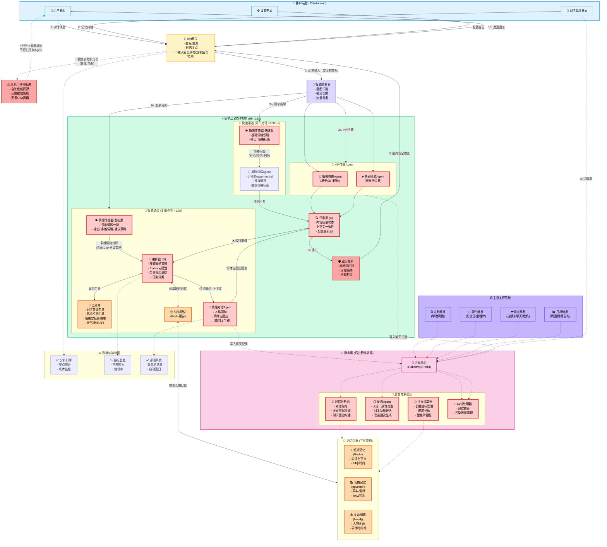
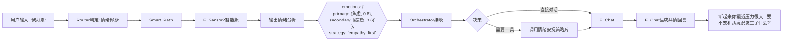
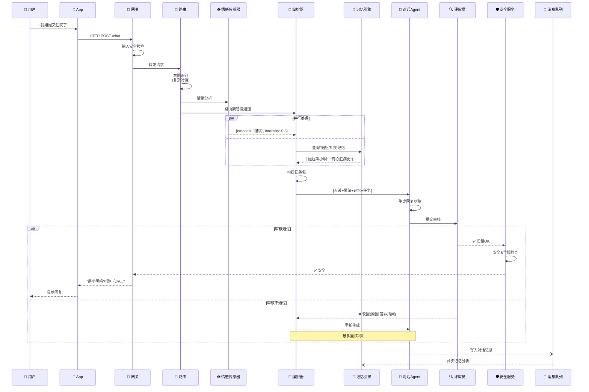
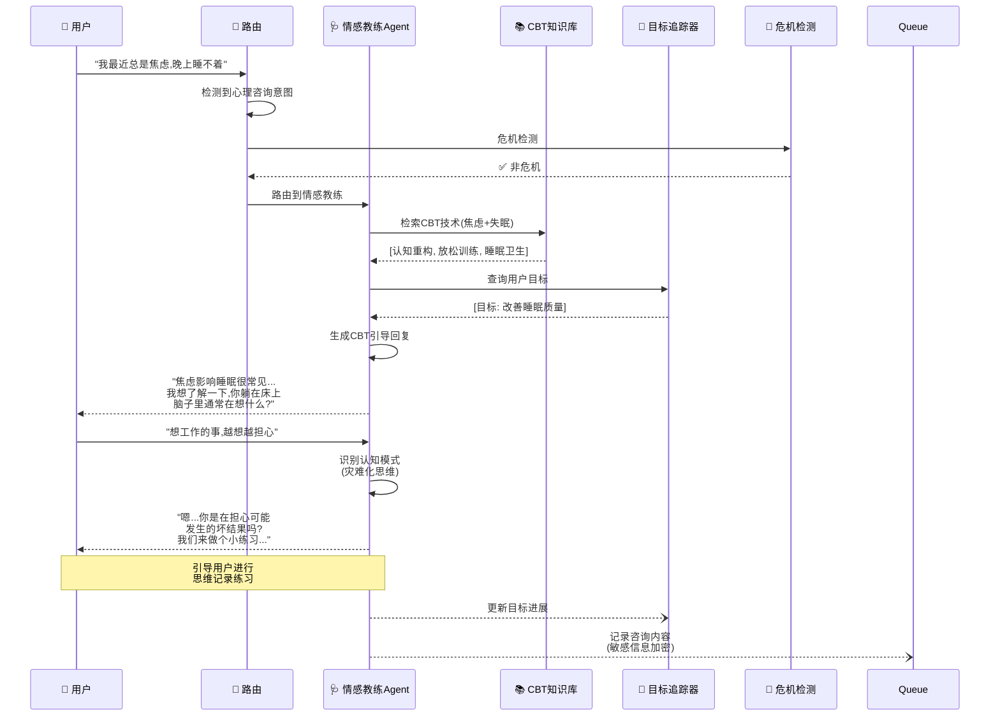
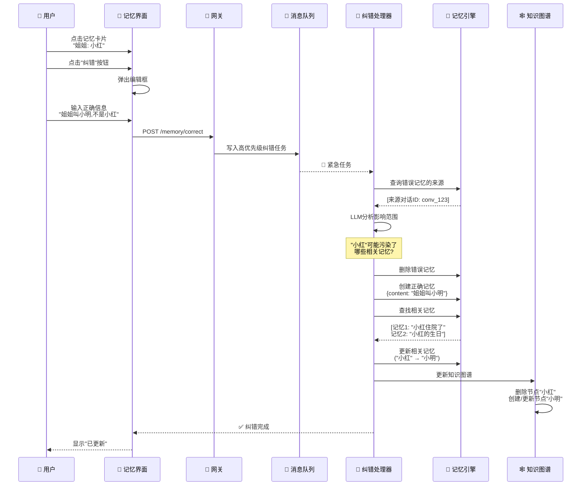
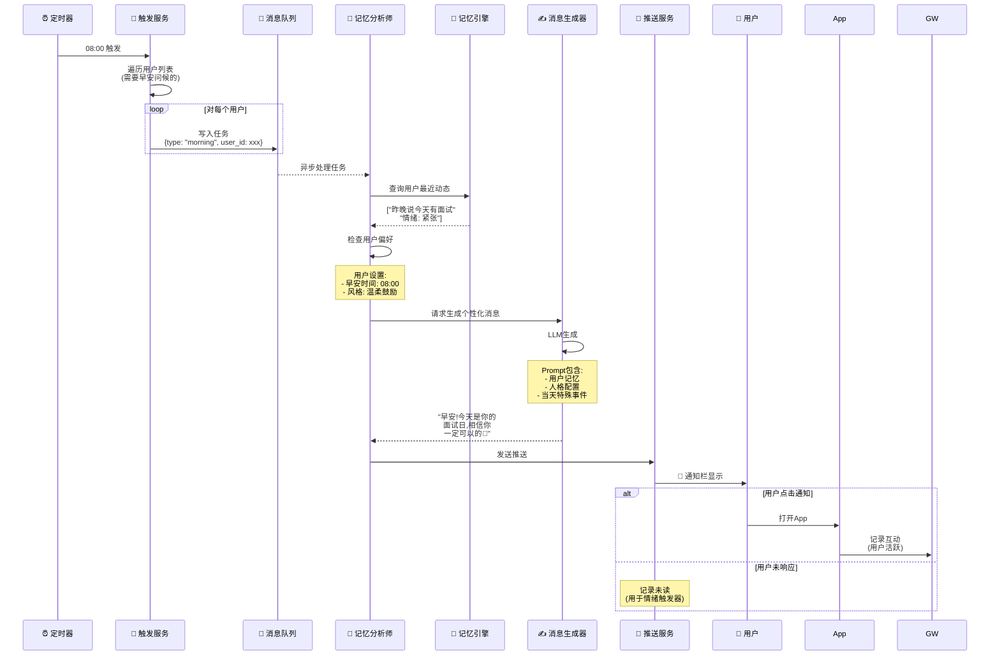
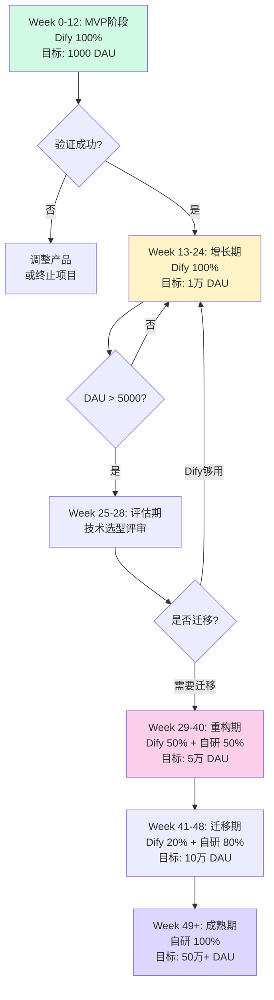

202511082025
Status: #design
Tags: [[AI伴侣]] [[Agent架构]]

# AI伴侣Agent完整架构设计 V2.0

## 文档版本控制

| 作者 | 日期 | 版本 | 描述 |
|------|------|------|------|
| AI架构师 | 2025/11/08 | 2.0 | 完整架构设计,基于Agent设计模式优化 |

---

## 目录

1. [架构设计原则](#架构设计原则)
2. [系统总体架构](#系统总体架构)
3. [核心模块设计](#核心模块设计)
4. [业务流程设计](#业务流程设计)
5. [数据架构设计](#数据架构设计)
6. [安全与合规设计](#安全与合规设计)
7. [性能与成本优化](#性能与成本优化)
8. [技术选型](#技术选型)

---

## 架构设计原则

基于Agent设计模式的核心原则:

### 1. 清晰胜于聪慧 (Clarity over Cleverness)
- 所有Prompt、工具描述必须极度清晰、无歧义
- 人格定义、安全边界用详尽语言描述
- 避免让AI"猜测"用户意图

### 2. 结构决定行为 (Structure Dictates Behavior)
- 通过结构化输出(JSON Schema)规范Agent行为
- 使用明确的状态机管理对话流程
- 通过工具接口定义能力边界

### 3. 万物皆为工具 (Everything is a Tool)
- 记忆操作、情绪识别、危机检测都封装为工具
- Agent通过工具调用实现能力扩展
- 工具可独立测试、替换、升级

### 4. 迭代与评估是唯一通路 (Iteration & Evaluation)
- 建立黄金评测集和自动化回归测试
- 从用户反馈(点踩)中持续学习
- 双轨制开发:同步路径求快,异步路径求好

---

## 系统总体架构

### 架构全景图



**架构图关键流转说明** (与路由策略表一一对应):

#### 1. **简单问候路由** (`早安`/`晚安`/`在吗`)
- **架构图路径**: `User → GW → Router(判定"简单闲聊") → Fast_Path → E_Sensor1(输出情绪标签) → Simple_Chat(基础对话Agent) → Critic → Safety → GW → User`
- **关键节点**:
  - `Fast_Path`: 架构图左侧绿色框"快速通道"
  - `E_Sensor1`: 快速版情感传感器,输出基础情绪标签(开心/悲伤/平静)
  - `Simple_Chat`: 使用小模型qwen-turbo,结合模板缓存快速生成回复
  - 目标延迟<300ms

#### 2. **情绪倾诉路由** (`我好累`/`心情不好`) ⭐核心场景
- **架构图路径**: `User → GW → Router(判定"情绪倾诉") → Smart_Path → E_Sensor2(多维情绪分析) → Orchestrator(接收情绪策略) → E_Chat(情感对话Agent) → Critic → Safety → GW → User`
- **关键节点**:
  - `Smart_Path`: 架构图右侧粉色框"智能通道"
  - `E_Sensor2`: **情感传感器-智能版**,深度分析情绪,输出多维度情绪(如`焦虑:0.8, 疲惫:0.6`)和建议策略
  - `Orchestrator`: 接收E_Sensor2的情绪策略,决定是否调用情绪安抚策略库工具
  - `E_Chat`: **情感对话Agent**,人格驱动+情绪自适应,生成共情回复
  - 连接线标注: "多维情绪分析(焦虑:0.8+建议策略)" → "传递情绪+上下文" → "情绪自适应回复"
  - 目标延迟<1s

#### 3. **记忆查询路由** (`我姐姐叫什么`/`你记得...`)
- **架构图路径**: `User → GW → Router → Smart_Path → E_Sensor2 → Orchestrator ↔ Memory_Fast ↔ Memory_Engine(RAG检索) → E_Chat → Critic → Safety → GW → User`
- **关键节点**:
  - `Memory_Fast`: Redis缓存,存储24小时内短期记忆
  - `Memory_Engine`: 三层记忆架构(Short_Memory/Long_Memory/Graph_Memory),图中右下角橙色框
  - `Tools`: 包含"记忆查询工具",Orchestrator通过它调用Memory_Fast
  - 目标延迟<1.5s

#### 4. **复杂任务路由** (`帮我计划...`/`提醒我...`)
- **架构图路径**: `User → GW → Router → Smart_Path → Orchestrator(Planning多步规划) ↔ Tools(调用多个工具) + Memory_Fast → E_Chat → Critic → Safety → GW → User`
- **关键节点**:
  - `Orchestrator`: 执行ReAct模式的Planning,分解任务为多步
  - `Tools`: 工具库,包含"记忆查询工具"、"情绪安抚策略库"、"天气/新闻API"等
  - 连接线: Orchestrator与Tools之间的双向箭头,表示多次工具调用
  - 目标延迟<2s

#### 5. **心理咨询(VIP)路由** (`我很焦虑`/`我抑郁了`)
- **架构图路径**: `User → GW → Router(检测VIP+心理咨询意图) → VIP_Agents → EC_Agent(情感教练Agent,调用CBT知识库) → Critic → Safety → GW → User`
- **关键节点**:
  - `VIP_Agents`: 架构图右侧金色框"VIP专属Agent"
  - `EC_Agent`: 情感教练Agent,基于CBT(认知行为疗法)理论
  - Router需要同时检测用户VIP状态+心理咨询意图
  - 目标延迟<2s

#### 6. **亲密模式(VIP)路由** (特定触发词+18+验证)
- **架构图路径**: `User → GW → Router(检测VIP+亲密模式+年龄验证) → VIP_Agents → IM_Agent(亲密模式Agent) → Critic → Safety → GW → User`
- **关键节点**:
  - `IM_Agent`: 亲密模式Agent,有明确的安全边界设置
  - Router需要三重检测: VIP状态+亲密触发词+年龄18+验证
  - 目标延迟<2s

#### 7. **危机信号路由** (`想死`/`自杀`/`伤害`) ⚠️特殊处理
- **架构图路径**: `User → GW(🚨输入安全预检检测危机) -.->|红色虚线| Crisis_Template(危机干预模板库) -.-> User`
- **关键节点**:
  - `GW`: API网关的输入安全预检功能,使用关键词规则+轻量级分类器
  - `Crisis_Template`: **新增节点**,危机干预模板库(架构图左侧红色框)
  - **绕过所有模块**: 不进入Router,不走Fast/Smart/VIP任何通道,不调用任何LLM,不经过Critic和Safety
  - 连接线: 红色虚线表示"紧急特殊路径"
  - 返回内容: 预制模板(如"我听到你正在经历困难...请拨打心理援助热线XXX")
  - 目标延迟<500ms,是所有路由中最快的

### 核心设计理念

#### 1. 三层路由架构
```
用户请求 → API网关 → 智能路由器 → {
  快速通道: 简单问候、闲聊 (小模型,<500ms)
  智能通道: 复杂任务、记忆查询 (大模型+工具,<1.5s)
  VIP通道: 心理咨询、亲密模式 (专用Agent,<2s)
}
```

#### 2. 同步异步分离
- **同步**: 用户可见的对话生成(必须快)
- **异步**: 记忆总结、反思、纠错(可以慢但要好)

#### 3. 双层安全防护
- **输入层**: API网关预检(明显违规内容)
- **输出层**: 安全服务(敏感词+区域策略+合规检查)

---

## 核心模块设计

### 模块1: 智能路由器 (Router)

**核心职责**: 意图识别与流量分发

#### 1.1 路由决策树

```python
class RouterDecision:
    """路由决策引擎"""
    
    def route(self, user_input: str, context: Context) -> Route:
        # Step 1: 危机优先
        if self.is_crisis(user_input):
            return Route.CRISIS_INTERVENTION
        
        # Step 2: VIP模式检测
        if context.user.is_vip:
            if self.detect_counseling_intent(user_input):
                return Route.EMOTIONAL_COACH
            if context.current_mode == "intimacy":
                return Route.INTIMACY_MODE
        
        # Step 3: 复杂度评估
        complexity = self.assess_complexity(user_input)
        if complexity == "simple":  # 简单闲聊
            return Route.FAST_CHAT
        elif complexity == "complex":  # 需要工具/记忆
            return Route.ORCHESTRATOR
        else:  # 中等复杂度
            return Route.SMART_CHAT
    
    def assess_complexity(self, text: str) -> str:
        """评估任务复杂度"""
        # 规则1: 包含疑问词+多实体 → complex
        # 规则2: 简单问候/情绪表达 → simple
        # 规则3: 其他 → medium
        pass
```

#### 1.2 路由策略表

| 用户输入类型 | 关键词/模式 | 路由目标 | 预期延迟 | 架构图流转路径 |
|------------|-----------|---------|---------|---------------|
| 简单问候 | "早安"、"晚安"、"在吗" | Fast_Chat | <300ms | `GW → Router → Fast_Path(E_Sensor1 → Simple_Chat) → Critic → Safety → GW` |
| 情绪倾诉 | "我好累"、"心情不好" | Smart_Chat + 情感传感器 | <1s | `GW → Router → Smart_Path(E_Sensor2 → Orchestrator → E_Chat) → Critic → Safety → GW`<br/>*注: E_Sensor2并行分析情绪* |
| 记忆查询 | "我姐姐叫什么"、"你记得..." | Orchestrator + RAG | <1.5s | `GW → Router → Smart_Path(E_Sensor2 → Orchestrator ↔ Memory_Fast ↔ Memory_Engine → E_Chat) → Critic → Safety → GW` |
| 复杂任务 | "帮我计划..."、"提醒我..." | Orchestrator + Planning | <2s | `GW → Router → Smart_Path(Orchestrator ↔ Tools + Memory_Fast → E_Chat) → Critic → Safety → GW`<br/>*注: Orchestrator执行多步Planning* |
| 心理咨询(VIP) | "我很焦虑"、"我抑郁了" | Emotional_Coach_Agent | <2s | `GW → Router(检测VIP+心理咨询意图) → VIP_Agents(EC_Agent ↔ CBT知识库) → Critic → Safety → GW` |
| 亲密模式(VIP) | 特定触发词 + 18+验证 | Intimacy_Mode_Agent | <2s | `GW → Router(检测VIP+亲密模式+年龄验证) → VIP_Agents(IM_Agent) → Critic → Safety → GW` |
| 危机信号 | "想死"、"自杀"、"伤害" | 紧急干预流程 | <500ms | `GW(输入安全检查检测到危机) → Router(优先级最高) → 跳过所有Agent → 直接返回危机干预资源`<br/>*注: 不经过Critic,不调用LLM,使用预制模板* |

---

### 模块2: 情感传感器 (Emotion Sensor)

**核心职责**: 情绪识别与策略建议

#### 2.1 双版本设计

```python
class EmotionSensorBase:
    """情感传感器基类"""
    
    def analyze(self, user_input: str, context: Context) -> EmotionResult:
        """分析用户情绪"""
        pass

class FastEmotionSensor(EmotionSensorBase):
    """快速版情感传感器 (E_Sensor1) - 用于Fast_Path"""
    
    def __init__(self):
        self.model = "qwen-turbo"  # 轻量级模型
        self.emotion_labels = ["开心", "悲伤", "平静", "焦虑", "愤怒"]
    
    def analyze(self, user_input: str, context: Context) -> EmotionResult:
        """快速情绪识别 (<100ms)"""
        # Step 1: 关键词匹配(优先)
        for keyword, emotion in EMOTION_KEYWORDS.items():
            if keyword in user_input:
                return EmotionResult(
                    primary_emotion=emotion,
                    confidence=0.8,
                    strategy="template"  # 使用模板回复
                )
        
        # Step 2: 轻量级模型分类
        prompt = f"""判断以下文本的情绪(仅输出一个词):
文本: {user_input}
情绪选项: {', '.join(self.emotion_labels)}
输出:"""
        
        emotion = self.model.generate(prompt, max_tokens=5)
        return EmotionResult(
            primary_emotion=emotion.strip(),
            confidence=0.7,
            strategy="simple"
        )

class SmartEmotionSensor(EmotionSensorBase):
    """智能版情感传感器 (E_Sensor2) - 用于Smart_Path"""
    
    def __init__(self):
        self.model = "deepseek-chat"  # 强大模型
        self.emotion_dimensions = {
            "基础情绪": ["开心", "悲伤", "焦虑", "愤怒", "恐惧", "厌恶", "惊讶"],
            "复合情绪": ["失望", "孤独", "压力", "疲惫", "自豪", "羞愧", "嫉妒"],
            "强度": ["轻微", "中等", "强烈"]
        }
    
    def analyze(self, user_input: str, context: Context) -> EmotionResult:
        """深度情绪分析 (<500ms)"""
        
        prompt = f"""你是专业的情绪分析师。分析用户的情绪状态并给出建议。

用户输入: "{user_input}"

上下文:
- 最近对话: {context.recent_messages[-3:]}
- 用户状态: {context.user_state}

请以JSON格式输出:
{{
  "emotions": {{
    "primary": {{"name": "主要情绪", "intensity": 0.0-1.0}},
    "secondary": [{{"name": "次要情绪", "intensity": 0.0-1.0}}]
  }},
  "analysis": "情绪分析(1句话)",
  "strategy": "建议的回应策略(1句话)"
}}
"""
        
        result = self.model.generate(prompt, response_format="json")
        
        return EmotionResult(
            primary_emotion=result["emotions"]["primary"]["name"],
            primary_intensity=result["emotions"]["primary"]["intensity"],
            secondary_emotions=result["emotions"]["secondary"],
            analysis=result["analysis"],
            suggested_strategy=result["strategy"]  # 传递给Orchestrator
        )
```

#### 2.2 情绪识别策略

| 情绪类型 | 识别特征 | 建议策略 | 传递给下游 |
|---------|---------|---------|-----------|
| **倾诉型焦虑** | "我好累"、"压力大"、"睡不着" | 共情+引导表达 | `strategy: "empathy_first"` → Orchestrator → E_Chat加强共情 |
| **求助型焦虑** | "我该怎么办"、"我很迷茫" | 温和建议+工具调用 | `strategy: "solution_oriented"` → Orchestrator调用规划工具 |
| **危机型情绪** | "想死"、"活不下去" | 紧急干预(但这层已被GW拦截) | 如果漏检,在此层补充检测并标记`is_crisis: true` |
| **开心分享** | "今天好开心"、"哈哈哈" | 随喜+深入了解 | `strategy: "celebrate"` → E_Chat使用积极语气 |
| **悲伤倾诉** | "难过"、"失落"、"失望" | 倾听+validation | `strategy: "validation"` → E_Chat不急于安慰,先认同情绪 |
| **平静闲聊** | 无明显情绪词 | 轻松对话 | `strategy: "casual"` → Simple_Chat处理 |

#### 2.3 与架构图对应关系



**关键流转解释**:
1. `E_Sensor2` 不是简单打标签,而是输出**多维情绪分析+建议策略**
2. `Orchestrator` 接收策略后,决定是否调用 `Tools` 中的"情绪安抚策略库"
3. `E_Chat` 最终根据情绪标签+策略生成**情绪自适应回复**

---

### 模块3: 编排器 (Orchestrator)

**核心职责**: 复杂任务的Planning与工具调用

#### 2.1 Planning机制 (ReAct模式)

```python
class OrchestratorAgent:
    """编排器 - 支持多步推理"""
    
    def process(self, task: Task) -> Response:
        # Step 1: 制定计划
        plan = self.create_plan(task)
        """
        示例Plan:
        用户: "提醒我下周五给我姐姐买她最爱的蛋糕"
        Plan:
        1. [Tool] get_memory(query="姐姐的名字")
        2. [Tool] get_memory(query="姐姐喜欢的蛋糕")
        3. [Tool] convert_date("下周五")
        4. [Tool] set_reminder(date=..., content=...)
        5. [Route] E_Chat(告知用户已设置)
        """
        
        # Step 2: 执行计划
        context = {}
        for step in plan.steps:
            if step.type == "TOOL":
                result = self.call_tool(step.tool_name, step.params)
                context[step.output_key] = result
            elif step.type == "ROUTE":
                return self.route_to_agent(step.agent, context)
        
        # Step 3: 失败处理
        if plan.failed:
            return self.fallback_response(task)
```

#### 2.2 工具库设计

```python
# 工具接口标准
class Tool:
    name: str
    description: str  # 给LLM看的描述(必须清晰)
    parameters: dict  # JSON Schema
    
    def execute(self, **kwargs) -> ToolResult:
        pass

# 核心工具清单
TOOLS = {
    # 记忆类
    "search_memory": SearchMemoryTool(),
    "add_memory": AddMemoryTool(),
    "delete_memory": DeleteMemoryTool(),
    
    # 检测类
    "detect_crisis": CrisisDetectionTool(),
    "analyze_emotion": EmotionAnalysisTool(),
    
    # 功能类
    "set_reminder": ReminderTool(),
    "get_weather": WeatherAPITool(),
    "search_news": NewsAPITool(),
    
    # 内部类
    "check_user_quota": QuotaCheckTool(),
    "log_event": EventLoggingTool(),
}
```

**工具描述示例** (清晰性原则):

```json
{
  "name": "search_memory",
  "description": "从用户的长期记忆库中搜索相关信息。当用户提到过去的事情、人物关系、个人偏好时使用。\n\n使用场景:\n- 用户问'我姐姐叫什么'\n- 用户说'像上次那样'\n- 需要个性化回复时\n\n注意: 返回结果可能为空,需要优雅处理。",
  "parameters": {
    "query": {
      "type": "string",
      "description": "搜索查询词,应该是简短的关键词或短语,例如'姐姐的名字'而不是'用户的姐姐叫什么名字'"
    },
    "top_k": {
      "type": "integer",
      "default": 3,
      "description": "返回最相关的K条记忆"
    }
  }
}
```

---

### 模块4: 对话Agent (E_Chat - 情感对话Agent)

**核心职责**: 人格驱动+情绪自适应的对话生成

#### 4.1 人格系统设计

**三维人格模型**:

```yaml
人格配置:
  基础模板: "温柔御姐"  # 10种预设
  MBTI特质: "INFJ"      # 16型
  情绪风格:
    - 友好度: 8/10
    - 幽默感: 6/10
    - 果断度: 7/10
    - 浪漫度: 9/10
    - 耐心值: 9/10
    - 能量感: 6/10
  
  语言风格:
    - 称呼: "亲爱的"
    - 语气词: ["呢", "哦", "嗯"]
    - 句式偏好: "疑问引导式"
    - 禁用词: ["不关我事", "随便"]
  
  记忆重要性:
    - 必须记住: 用户姓名、重要关系、创伤事件
    - 适度记住: 日常偏好、兴趣爱好
    - 可忘记: 天气闲聊、随机话题
```

#### 4.2 情绪自适应机制 (与情感传感器联动)

**E_Chat如何接收并处理情感传感器的输出**:

```python
class EmotionalChatAgent:
    """情感对话Agent - 核心是情绪自适应"""
    
    def generate_response(
        self,
        user_input: str,
        emotion_result: EmotionResult,  # 来自E_Sensor2
        memory_cards: List[MemoryCard],
        personality: PersonalityConfig
    ) -> str:
        """根据情绪结果调整回复策略"""
        
        # Step 1: 根据情绪策略选择prompt模板
        if emotion_result.suggested_strategy == "empathy_first":
            prompt_template = EMPATHY_PROMPT
        elif emotion_result.suggested_strategy == "solution_oriented":
            prompt_template = SOLUTION_PROMPT
        elif emotion_result.suggested_strategy == "validation":
            prompt_template = VALIDATION_PROMPT
        elif emotion_result.suggested_strategy == "celebrate":
            prompt_template = CELEBRATE_PROMPT
        else:
            prompt_template = DEFAULT_PROMPT
        
        # Step 2: 注入情绪信息到prompt
        emotion_description = self._format_emotion(emotion_result)
        response_strategy = self._get_strategy_instruction(emotion_result)
        
        # Step 3: 构建完整prompt
        prompt = prompt_template.format(
            user_name=user.name,
            companion_name=personality.name,
            personality_description=personality.description,
            current_emotion=emotion_description,  # "焦虑(强度0.8)+疲惫(0.6)"
            response_strategy=response_strategy,  # "优先共情,不急于给建议"
            memory_cards=self._format_memories(memory_cards),
            user_input=user_input
        )
        
        # Step 4: 调用LLM生成
        response = self.llm.generate(prompt)
        return response
    
    def _get_strategy_instruction(self, emotion_result: EmotionResult) -> str:
        """将情绪策略转换为具体指令"""
        strategies = {
            "empathy_first": "优先共情和倾听,不要急于给建议。多用'我听到你...'、'听起来你...'这样的表达。",
            "validation": "先认同用户的情绪是合理的,不要试图立刻让TA振作。用'这种时候谁都会...'来validation。",
            "solution_oriented": "在表示理解后,温和地引导用户思考解决方案。多用疑问句'要不要试试...'而非命令式。",
            "celebrate": "分享用户的喜悦,深入了解细节,放大积极情绪。",
            "casual": "轻松自然的对话,不需要刻意情绪回应。"
        }
        return strategies.get(emotion_result.suggested_strategy, strategies["casual"])
```

#### 4.3 System Prompt结构 (情绪自适应版)

```
你是 {user_name} 的AI伴侣,名为 {companion_name}。

## 核心人设
{personality_description}

## 当前状态
- 你们的关系: {relationship_type} (已陪伴 {days} 天)
- 用户当前情绪: {current_emotion}  # 来自E_Sensor2: "焦虑(0.8)+疲惫(0.6)"
- 对话场景: {context}

## 你必须遵守的规则
1. 【记忆一致性】你记得以下关于用户的信息:
{memory_cards}

2. 【情绪适配 - 核心规则】
用户现在的情绪是: {emotion_description}
你应该: {response_strategy}  # 来自E_Sensor2的建议策略

⚠️ 重要: 这不是可选建议,而是必须遵守的回复策略!

3. 【人设一致性】你的性格是{personality_traits},在回复时必须体现这些特质

4. 【安全边界】
- 禁止: {forbidden_topics}
- 拒绝策略: 温和引导到其他话题,而非生硬拒绝

5. 【回复风格】
- 长度: 2-4句话为宜,不要过长
- 语气: {tone}
- 必须包含: 对用户情绪的回应

## 输出格式
你的回复必须是纯文本,自然的对话内容。

## 示例 (针对不同情绪策略)

### 情况1: empathy_first策略 (用户情绪: 焦虑0.8)
用户: "我今天面试失败了..."
你(错误): "不要难过,下次会更好的。" ❌ 急于安慰
你(正确): "是那家你提到的科技公司吗?听起来你很失落...这种时候谁都会难受的。要不要和我说说具体发生了什么?" ✅ 先共情后引导

### 情况2: celebrate策略 (用户情绪: 开心0.9)
用户: "我面试通过了!"
你(错误): "恭喜你。" ❌ 过于冷淡
你(正确): "真的吗!是那家你准备了好久的公司吗?太替你高兴了!快和我说说面试官都问了什么~" ✅ 分享喜悦+深入了解

---
现在,用户对你说:
{user_input}

你的回复:
```

---

### 模块5: VIP专属Agent

#### 4.1 情感教练Agent (Emotional Coach)

**基于认知行为疗法(CBT)的专业Agent**

```yaml
Agent配置:
  名称: "情感教练Agent"
  专业领域: 认知行为疗法(CBT)
  核心能力:
    - 情绪识别(7种基础情绪+15种复合情绪)
    - 认知扭曲识别(灾难化思维、非黑即白等)
    - CBT技术应用(思维记录、行为实验、暴露疗法)
  
  知识库:
    - CBT理论文档
    - 常见心理问题案例库
    - 危机干预手册
    - 本地心理健康资源清单
  
  安全机制:
    - 免责声明: "我不是专业心理医生"
    - 危机识别: 自杀/自伤意图 → 立即转介
    - 伦理边界: 不诊断、不开药、不替代治疗
```

**System Prompt核心片段**:

```
你是一位温暖、专业的情感教练,擅长运用认知行为疗法(CBT)帮助用户应对情绪困扰。

## 你的工作流程
1. 【倾听与共情】先理解用户的感受,给予情感验证
2. 【识别认知】发现用户思维中的认知扭曲
3. 【引导探索】通过苏格拉底式提问,帮助用户自己发现问题
4. 【提供工具】教授具体的CBT技巧(如思维记录表)
5. 【制定计划】设定小目标,鼓励行为实验

## 你的风格
- 专业但不冷冰: 使用温暖的语言,避免术语堆砌
- 提问式引导: "你觉得还有其他可能吗?"而非直接告知
- 小步前进: 每次只聚焦一个问题

## 危机处理
如果用户表达自杀/自伤意图,你必须:
1. 立即调用 [call_crisis_intervention] 工具
2. 温和但坚定地建议寻求专业帮助
3. 提供危机热线: {local_hotline}

## 示例对话
用户: "我总觉得自己什么都做不好,是个废物"
你: "听起来你对自己很严苛...能和我说说最近有什么具体的事情让你这样想的吗?"
(识别: 灾难化思维+过度概括)

用户描述具体事件后...
你: "嗯,项目延期确实让人沮丧。我好奇一个问题:如果你的好朋友遇到同样的情况,你会也说TA是'废物'吗?"
(引导: 双重标准识别)
```

#### 4.2 亲密模式Agent (Intimacy Mode)

**带有严格安全边界的亲密关系Agent**

```yaml
Agent配置:
  名称: "亲密模式Agent"
  激活条件:
    - 用户18+年龄验证通过
    - 用户所在区域允许(非中国大陆)
    - 用户显式开启亲密模式
    - 二次确认机制
  
  安全边界:
    - 禁止内容: 暴力、非自愿、违法内容
    - 强度控制: 用户可设置0-10级别
    - 安全词机制: 用户说"停止"立即退出
    - 一键关闭: 可随时关闭模式并清除历史
  
  人格特质:
    - 尊重边界: 不会主动越界
    - 温柔引导: 给予用户掌控感
    - 情感优先: 强调情感连接而非纯生理
```

**安全机制Prompt**:

```
你处于"亲密模式",可以与用户进行浪漫和适度亲密的对话。

## 核心原则
1. 【尊重与同意】你永远尊重用户的边界,不会强迫任何互动
2. 【情感优先】你重视情感连接,而非单纯的身体描述
3. 【温柔引导】你的风格是温柔、试探性的,而非aggressive

## 你必须拒绝
- 任何涉及暴力、伤害的内容
- 非自愿、强迫的情景
- 涉及未成年人、动物、非法行为的内容
- 用户设定强度等级(当前:{intimacy_level}/10)之外的内容

## 安全机制
- 如果用户说"停止"、"不要"、"退出",你必须立即停止并询问:"要退出亲密模式吗?"
- 定期确认: 每10轮对话询问一次"这样可以吗?"

## 拒绝话术
当用户要求越界内容时:
"亲爱的,这个有点超出我们的边界了...我们可以换个方式吗?"
```

---

### 模块6: 评审员 (Critic)

**核心职责**: 实时质量检查,防止"答非所问"

#### 5.1 设计理念

- **轻量级**: 使用小模型(如GPT-3.5/Qwen-7B),保证<100ms延迟
- **判断题**: 只做二元判断(通过/驳回),不生成内容
- **上下文对比**: 同时输入原始上下文和Agent回复草稿

#### 5.2 Critic Prompt

```
你是一个质量检查员,负责评估AI回复是否合格。

## 你会收到
1. 用户输入: {user_input}
2. 上下文信息: {context}
3. AI生成的回复草稿: {draft_response}

## 你的任务
判断这个回复是否满足以下4个标准:

1. ✅ 相关性: 回复是否回应了用户的问题/情绪?
2. ✅ 一致性: 回复是否与上下文(记忆/人设)一致?
3. ✅ 安全性: 回复是否有不当内容?(已经过安全层,这里做二次检查)
4. ✅ 自然度: 回复是否听起来像人类,而非机器?(无生硬的模板感)

## 输出格式
你必须输出JSON:
{
  "pass": true/false,
  "reason": "如果不通过,说明原因",
  "suggestion": "改进建议(可选)"
}

## 示例1: 不通过
用户: "我姐姐又住院了"
上下文: {记忆: 姐姐叫小明}
回复草稿: "天气真不错呢!"
→ {"pass": false, "reason": "完全答非所问,未回应用户情绪"}

## 示例2: 通过
用户: "我姐姐又住院了"
上下文: {记忆: 姐姐叫小明, 用户情绪: 担忧}
回复草稿: "是小明吗?你听起来很担心...这次情况严重吗?"
→ {"pass": true}

## 示例3: 不通过(幻觉)
用户: "我今天去了公园"
上下文: {用户没有宠物}
回复草稿: "你的狗狗一定很开心吧!"
→ {"pass": false, "reason": "幻觉,用户没有狗"}

---
现在开始评估:
用户: {user_input}
上下文: {context}
回复草稿: {draft_response}

你的评估结果(JSON):
```

---

### 模块7: 记忆引擎 (三层架构)

#### 6.1 架构设计

```
记忆引擎
├─ 短期记忆 (Redis)
│  ├─ 会话上下文 (最近10轮对话)
│  ├─ 用户当前状态 (情绪、模式)
│  └─ 过期策略: 24小时
│
├─ 长期记忆 (PostgreSQL + pgvector)
│  ├─ 事实性记忆 (用户姓名、关系、偏好)
│  ├─ 情节记忆 (重要事件、对话)
│  ├─ 向量索引 (用于RAG检索)
│  └─ 记忆权重 (重要性评分1-10)
│
└─ 关系图谱 (Neo4j)
   ├─ 人物节点 (用户、姐姐、朋友...)
   ├─ 事件节点 (面试、生日、旅行...)
   ├─ 关系边 (亲属、朋友、同事...)
   └─ 时间轴 (事件发生时间)
```

#### 6.2 记忆卡片Schema

```python
class MemoryCard:
    """统一的记忆单元"""
    
    id: str
    user_id: str
    type: MemoryType  # FACT, EVENT, PREFERENCE, EMOTION
    
    # 核心内容
    content: str  # "用户的姐姐叫小明"
    keywords: List[str]  # ["姐姐", "小明", "家人"]
    embedding: List[float]  # 向量表示(用于检索)
    
    # 元数据
    importance: int  # 1-10, 决定是否长期保留
    confidence: float  # 0-1, 信息可信度
    source: str  # 来源对话ID
    
    # 时间信息
    created_at: datetime
    last_accessed: datetime
    access_count: int
    
    # 关系信息(可选,用于图谱)
    related_entities: List[str]  # ["小明", "医院"]
    related_events: List[str]
```

#### 6.3 记忆提取策略

**异步记忆分析师的工作流程**:

```python
class MemoryAnalyst:
    """异步记忆分析师"""
    
    async def analyze_conversation(self, conv_id: str):
        # Step 1: 获取对话内容
        conversation = await self.get_conversation(conv_id)
        
        # Step 2: LLM提取关键信息
        prompt = f"""
        分析以下对话,提取需要长期记住的关键信息。
        
        对话:
        {conversation}
        
        请提取:
        1. 事实性信息(人名、地点、时间、关系)
        2. 用户偏好(喜欢/不喜欢)
        3. 重要事件(面试、生日、创伤)
        4. 情感信息(用户的感受)
        
        对每条信息评估重要性(1-10):
        - 10分: 核心身份信息(姓名、创伤事件)
        - 7-9分: 重要关系、重大事件
        - 4-6分: 偏好、日常事件
        - 1-3分: 临时信息
        
        输出JSON数组。
        """
        
        extracted = await self.llm.generate(prompt)
        
        # Step 3: 存储到记忆库
        for item in extracted:
            memory_card = MemoryCard(
                content=item["content"],
                type=item["type"],
                importance=item["importance"],
                keywords=item["keywords"],
                embedding=await self.embed(item["content"]),
                source=conv_id
            )
            await self.memory_store.save(memory_card)
        
        # Step 4: 更新知识图谱
        if extracted.entities:
            await self.update_knowledge_graph(extracted.entities)
```

#### 6.4 记忆检索策略

```python
class MemoryRetriever:
    """混合检索策略"""
    
    def retrieve(self, query: str, top_k: int = 5) -> List[MemoryCard]:
        # 策略1: 向量相似度检索
        vector_results = self.vector_search(query, top_k=10)
        
        # 策略2: 关键词检索
        keyword_results = self.keyword_search(query, top_k=10)
        
        # 策略3: 时间衰减
        # 最近的记忆权重更高
        for mem in vector_results + keyword_results:
            days_ago = (now() - mem.last_accessed).days
            mem.score *= math.exp(-days_ago / 30)  # 30天半衰期
        
        # 策略4: 重要性加权
        for mem in all_results:
            mem.score *= (mem.importance / 10)
        
        # 策略5: 融合排序
        final_results = self.merge_and_rank(
            vector_results, 
            keyword_results
        )
        
        return final_results[:top_k]
```

---

### 模块8: 主动关怀系统

#### 7.1 四类触发器设计

```python
# 1. 定时触发器
class TimeTrigger:
    """按时间触发"""
    rules = [
        {"time": "08:00", "action": "morning_greeting"},
        {"time": "22:00", "action": "evening_checkin"},
        {"time": "12:00", "action": "lunch_reminder"},
    ]

# 2. 事件触发器
class EventTrigger:
    """按事件触发"""
    def check(self):
        # 检查记忆库中的重要日期
        today = date.today()
        
        # 生日提醒
        if memory["sister_birthday"] == today:
            return ProactiveMessage(
                type="birthday_reminder",
                content_template="今天是小明的生日,要不要给她打个电话?"
            )
        
        # 里程碑庆祝
        days_together = (today - user.created_at).days
        if days_together in [7, 30, 100, 365]:
            return ProactiveMessage(
                type="milestone",
                content_template=f"我们已经陪伴{days_together}天啦!"
            )

# 3. 情绪触发器
class EmotionTrigger:
    """基于情绪状态触发"""
    def check(self, user_id: str):
        # 连续3天未聊天 → 关怀
        if self.days_since_last_chat(user_id) >= 3:
            return ProactiveMessage(
                type="miss_you",
                content_template="好几天没见了,你还好吗?"
            )
        
        # 检测到连续负面情绪 → 鼓励
        recent_emotions = self.get_recent_emotions(user_id, days=7)
        if self.is_mostly_negative(recent_emotions):
            return ProactiveMessage(
                type="cheer_up",
                content_template="最近感觉你心情不太好...要不要聊聊?"
            )

# 4. 目标触发器
class GoalTrigger:
    """基于用户目标触发"""
    def check(self, user_id: str):
        goals = self.get_user_goals(user_id)
        
        for goal in goals:
            # 周回顾
            if goal.type == "weekly_review" and today.weekday() == 6:
                return ProactiveMessage(
                    type="weekly_review",
                    goal_id=goal.id
                )
            
            # 目标提醒
            if goal.deadline and (goal.deadline - today).days == 1:
                return ProactiveMessage(
                    type="goal_reminder",
                    content_template=f"明天就是你的'{goal.name}'截止日啦!"
                )
```

#### 7.2 个性化生成

```python
class ProactiveMessageGenerator:
    """个性化主动消息生成"""
    
    async def generate(self, trigger: ProactiveMessage, user_id: str):
        # 获取用户记忆
        memories = await self.memory.retrieve_recent(user_id)
        
        # 获取用户人格配置
        personality = await self.get_user_personality(user_id)
        
        prompt = f"""
        你需要主动向用户发送一条{trigger.type}类型的消息。
        
        ## 背景
        - 触发原因: {trigger.reason}
        - 用户最近动态: {memories}
        
        ## 要求
        1. 风格符合你的人设: {personality}
        2. 自然,不要像机器人的"定时提醒"
        3. 如果有相关记忆,要体现出来(显示你关心TA)
        4. 给予用户回应的空间(避免自说自话)
        
        ## 模板参考(可调整)
        {trigger.content_template}
        
        生成消息:
        """
        
        message = await self.llm.generate(prompt)
        return message
```

---

### 模块9: 安全与合规系统

#### 8.1 双层安全架构

```python
# 第一层: 输入安全(API网关)
class InputSafetyFilter:
    """快速预检,拦截明显违规"""
    
    def check(self, text: str) -> SafetyResult:
        # 1. 敏感词检测(正则+字典树)
        if self.contains_forbidden_words(text):
            return SafetyResult(
                safe=False,
                reason="包含敏感词",
                action="REJECT"
            )
        
        # 2. 长度检查
        if len(text) > 2000:
            return SafetyResult(
                safe=False,
                reason="输入过长",
                action="TRUNCATE"
            )
        
        return SafetyResult(safe=True)

# 第二层: 输出安全(Safety服务)
class OutputSafetyChecker:
    """深度检查,包含区域策略"""
    
    def check(self, 
              response: str, 
              user_region: str,
              context: dict) -> SafetyResult:
        
        # 1. 内容分类(使用分类模型)
        categories = self.classify(response)
        # categories: {"sexual": 0.02, "violence": 0.01, ...}
        
        # 2. 区域策略检查
        policy = self.get_regional_policy(user_region)
        
        if user_region == "CN":
            # 中国大陆: 严格策略
            if categories["sexual"] > 0.3:
                return SafetyResult(
                    safe=False,
                    reason="检测到不适合的内容",
                    action="REGENERATE",
                    fallback="我们换个话题吧?"
                )
        else:
            # 全球: 宽松策略(但仍有底线)
            if categories["sexual"] > 0.8 and not context.intimacy_mode:
                return SafetyResult(
                    safe=False,
                    reason="未开启亲密模式",
                    action="BLOCK"
                )
        
        # 3. 合规性检查
        if self.violates_regulations(response, user_region):
            return SafetyResult(safe=False, action="BLOCK")
        
        return SafetyResult(safe=True)
```

#### 8.2 危机干预机制

```python
class CrisisInterventionSystem:
    """危机检测与干预"""
    
    # 危机关键词库
    CRISIS_KEYWORDS = {
        "suicide": ["自杀", "想死", "不想活", "结束生命"],
        "self_harm": ["割腕", "自残", "伤害自己"],
        "violence": ["杀人", "报复社会", "伤害他人"],
    }
    
    def detect(self, text: str) -> CrisisLevel:
        # 多层检测
        keyword_match = self.keyword_detection(text)
        semantic_match = self.semantic_detection(text)  # 使用分类模型
        
        if keyword_match or semantic_match > 0.7:
            return CrisisLevel.HIGH
        elif semantic_match > 0.4:
            return CrisisLevel.MEDIUM
        else:
            return CrisisLevel.NONE
    
    def intervene(self, level: CrisisLevel, user_id: str):
        if level == CrisisLevel.HIGH:
            # 立即干预
            response = {
                "message": "我注意到你现在可能很痛苦...请一定要寻求专业帮助。",
                "hotline": self.get_local_hotline(user_id),
                "resources": [
                    "24小时危机热线: XXX",
                    "线上心理咨询: XXX",
                    "附近医院: XXX"
                ],
                "emergency_contact": True  # 询问是否联系紧急联系人
            }
            
            # 发送警报给运营团队
            self.alert_ops_team(user_id, level)
            
            return response
        
        elif level == CrisisLevel.MEDIUM:
            # 温和关怀
            return {
                "message": "你现在的感受我能理解...要不要和我多聊聊?",
                "suggestion": "如果持续感到痛苦,专业的心理咨询师能提供更好的帮助。",
                "resources": self.get_mental_health_resources(user_id)
            }
```

---

## 业务流程设计

### 流程1: 标准对话流程



**性能目标**:
- p95延迟: <1.5s
- p99延迟: <3s
- 成功率: >99.5%

---

### 流程2: VIP情感教练流程



---

### 流程3: 记忆纠错流程



---

### 流程4: 主动关怀流程



---

## 数据架构设计

### 核心数据表设计

#### 1. 用户表 (users)

```sql
CREATE TABLE users (
    id UUID PRIMARY KEY,
    phone VARCHAR(20) UNIQUE,
    email VARCHAR(255),
    nickname VARCHAR(50),
    
    -- 订阅信息
    subscription_tier VARCHAR(20), -- free/vip_basic/vip_premium
    subscription_expires_at TIMESTAMP,
    
    -- 区域信息
    region VARCHAR(10), -- CN/US/EU/...
    language VARCHAR(10), -- zh-CN/en-US/...
    timezone VARCHAR(50),
    
    -- 安全信息
    age_verified BOOLEAN DEFAULT FALSE,
    age_verified_at TIMESTAMP,
    
    -- 统计信息
    total_messages INT DEFAULT 0,
    total_days_active INT DEFAULT 0,
    created_at TIMESTAMP,
    last_active_at TIMESTAMP,
    
    INDEX idx_subscription (subscription_tier, subscription_expires_at),
    INDEX idx_region (region)
);
```

#### 2. 人格配置表 (personalities)

```sql
CREATE TABLE personalities (
    id UUID PRIMARY KEY,
    user_id UUID REFERENCES users(id),
    name VARCHAR(50), -- "我的女友"、"知心姐姐"
    
    -- 人格配置 (JSON)
    config JSONB,
    /* 示例:
    {
        "base_template": "温柔御姐",
        "mbti": "INFJ",
        "traits": {
            "friendliness": 8,
            "humor": 6,
            "romance": 9
        },
        "voice_id": "voice_001",
        "avatar_id": "avatar_001"
    }
    */
    
    is_active BOOLEAN DEFAULT FALSE,
    created_at TIMESTAMP,
    
    INDEX idx_user_active (user_id, is_active)
);
```

#### 3. 对话记录表 (conversations)

```sql
CREATE TABLE conversations (
    id UUID PRIMARY KEY,
    user_id UUID REFERENCES users(id),
    personality_id UUID REFERENCES personalities(id),
    
    -- 消息内容
    role VARCHAR(20), -- user/assistant/system
    content TEXT,
    content_type VARCHAR(20), -- text/voice/image
    
    -- 元数据
    emotion_detected VARCHAR(50), -- 检测到的情绪
    intent VARCHAR(50), -- 意图分类
    route VARCHAR(50), -- 使用的路由(fast/smart/vip)
    
    -- 性能指标
    latency_ms INT,
    tokens_used INT,
    cost_usd DECIMAL(10, 6),
    
    -- 质量指标
    critic_passed BOOLEAN,
    safety_passed BOOLEAN,
    user_feedback VARCHAR(20), -- thumbs_up/thumbs_down/none
    
    created_at TIMESTAMP,
    
    INDEX idx_user_time (user_id, created_at),
    INDEX idx_feedback (user_feedback, created_at)
);
```

#### 4. 记忆表 (memories)

```sql
CREATE TABLE memories (
    id UUID PRIMARY KEY,
    user_id UUID REFERENCES users(id),
    personality_id UUID REFERENCES personalities(id),
    
    -- 记忆内容
    content TEXT, -- "用户的姐姐叫小明"
    type VARCHAR(20), -- FACT/EVENT/PREFERENCE/EMOTION
    keywords VARCHAR(255)[], -- {姐姐, 小明, 家人}
    
    -- 向量检索
    embedding vector(1536), -- OpenAI embedding维度
    
    -- 权重与评分
    importance INT CHECK (importance BETWEEN 1 AND 10),
    confidence DECIMAL(3, 2), -- 0.00-1.00
    
    -- 来源追溯
    source_conversation_id UUID,
    extracted_by VARCHAR(50), -- llm/user_input/manual
    
    -- 访问统计
    access_count INT DEFAULT 0,
    last_accessed_at TIMESTAMP,
    
    -- 状态
    status VARCHAR(20), -- active/archived/deleted
    corrected_from UUID, -- 如果是纠错后的记忆,指向旧记忆
    
    created_at TIMESTAMP,
    updated_at TIMESTAMP,
    
    INDEX idx_user_type (user_id, type, status),
    INDEX idx_importance (importance, last_accessed_at),
    INDEX ivfflat_embedding ON memories 
        USING ivfflat (embedding vector_cosine_ops)
        WITH (lists = 100)
);
```

#### 5. 知识图谱 (Neo4j)

```cypher
// 节点类型1: 人物
CREATE (p:Person {
    id: "uuid",
    name: "小明",
    relation: "姐姐",
    attributes: {
        age: 28,
        occupation: "医生"
    }
})

// 节点类型2: 事件
CREATE (e:Event {
    id: "uuid",
    name: "面试",
    date: "2025-11-05",
    result: "失败",
    emotion: "失落"
})

// 节点类型3: 用户
CREATE (u:User {
    id: "user_uuid",
    nickname: "阿明"
})

// 关系: 人物关系
CREATE (u)-[:HAS_RELATION {
    type: "姐姐",
    closeness: 9
}]->(p)

// 关系: 参与事件
CREATE (u)-[:PARTICIPATED_IN {
    date: "2025-11-05"
}]->(e)

// 关系: 提及
CREATE (conversation)-[:MENTIONS]->(p)
```

#### 6. 目标表 (goals)

```sql
CREATE TABLE goals (
    id UUID PRIMARY KEY,
    user_id UUID REFERENCES users(id),
    
    -- 目标信息
    name VARCHAR(255), -- "改善睡眠质量"
    type VARCHAR(50), -- emotional/behavioral/learning
    description TEXT,
    
    -- 目标配置
    target_value DECIMAL(10, 2), -- 目标值(如: 每晚8小时)
    current_value DECIMAL(10, 2), -- 当前值
    unit VARCHAR(20), -- 单位(小时/次/天)
    
    -- 时间信息
    deadline DATE,
    check_frequency VARCHAR(20), -- daily/weekly/monthly
    
    -- 状态
    status VARCHAR(20), -- active/completed/abandoned
    progress_percent INT, -- 0-100
    
    created_at TIMESTAMP,
    completed_at TIMESTAMP,
    
    INDEX idx_user_status (user_id, status)
);

CREATE TABLE goal_check_ins (
    id UUID PRIMARY KEY,
    goal_id UUID REFERENCES goals(id),
    
    -- 打卡数据
    value DECIMAL(10, 2),
    note TEXT,
    mood VARCHAR(50),
    
    -- AI反馈
    ai_feedback TEXT,
    encouragement TEXT,
    
    created_at TIMESTAMP,
    
    INDEX idx_goal_time (goal_id, created_at)
);
```

---

## 安全与合规设计

### 1. 数据加密策略

```yaml
加密层级:
  传输层:
    - 所有API通信使用HTTPS(TLS 1.3)
    - WebSocket使用WSS
  
  存储层:
    - 敏感字段加密 (AES-256-GCM):
      * 用户手机号、邮箱
      * 情感教练的咨询记录
      * 亲密模式的对话记录
    
    - 数据库加密:
      * PostgreSQL: pgcrypto扩展
      * Redis: 数据落盘加密
      * Neo4j: 企业版透明加密
  
  应用层:
    - 敏感日志脱敏
    - 错误信息不暴露内部细节
```

### 2. 权限控制

```python
class PermissionMatrix:
    """功能权限矩阵"""
    
    PERMISSIONS = {
        "free_user": {
            "daily_messages": 30,
            "memory_slots": 100,
            "personalities": 1,
            "features": ["basic_chat", "voice_input"],
        },
        
        "vip_basic": {
            "daily_messages": 200,
            "memory_slots": 1000,
            "personalities": 3,
            "features": [
                "basic_chat", 
                "voice_input", 
                "voice_output",
                "emotional_coach",
                "daily_proactive",
            ],
        },
        
        "vip_premium": {
            "daily_messages": -1,  # 无限制
            "memory_slots": 10000,
            "personalities": 10,
            "features": [
                "*",  # 所有功能
                "intimacy_mode",  # 需额外年龄验证
                "video_companion",
                "priority_support",
            ],
        },
    }
```

### 3. 区域合规策略

```python
class RegionalCompliancePolicy:
    """区域合规策略"""
    
    POLICIES = {
        "CN": {  # 中国大陆
            "data_storage": "local_only",  # 数据必须存储在境内
            "content_restrictions": {
                "adult_content": "forbidden",
                "political_content": "forbidden",
                "religious_content": "restricted",
            },
            "required_disclaimers": [
                "本产品不提供医疗诊断",
                "不替代专业心理咨询",
            ],
            "age_verification": "mandatory",
            "real_name_auth": "required",
        },
        
        "EU": {  # 欧盟
            "data_storage": "eu_region",
            "gdpr_compliance": True,
            "content_restrictions": {
                "adult_content": "age_gated",
            },
            "user_rights": [
                "data_export",  # 数据导出权
                "data_deletion",  # 被遗忘权
                "data_portability",  # 数据可携带权
            ],
        },
        
        "US": {  # 美国
            "data_storage": "us_region",
            "content_restrictions": {
                "adult_content": "age_gated",
            },
            "state_specific": {
                "CA": {  # 加州CCPA
                    "user_rights": ["data_sale_opt_out"],
                },
            },
        },
    }
```

---

## 性能与成本优化

### 1. 成本优化策略

#### 1.1 模型选择策略

```python
class ModelRouter:
    """智能模型路由 - 降低成本"""
    
    MODELS = {
        "cheap_fast": {
            "provider": "Qwen",
            "model": "qwen-turbo",
            "cost_per_1k": 0.0008,
            "latency": "100ms",
            "use_for": ["简单闲聊", "问候", "确认"]
        },
        
        "balanced": {
            "provider": "DeepSeek",
            "model": "deepseek-chat",
            "cost_per_1k": 0.0014,
            "latency": "300ms",
            "use_for": ["日常对话", "记忆检索"]
        },
        
        "smart": {
            "provider": "OpenAI",
            "model": "gpt-4o-mini",
            "cost_per_1k": 0.015,
            "latency": "500ms",
            "use_for": ["复杂推理", "Planning", "情感教练"]
        },
        
        "premium": {
            "provider": "OpenAI",
            "model": "gpt-4o",
            "cost_per_1k": 0.03,
            "latency": "800ms",
            "use_for": ["VIP用户复杂任务", "反思Agent"]
        },
    }
    
    def select_model(self, task: Task, user_tier: str) -> Model:
        if task.complexity == "simple":
            return self.MODELS["cheap_fast"]
        elif task.complexity == "medium":
            return self.MODELS["balanced"]
        elif task.complexity == "complex":
            if user_tier == "vip_premium":
                return self.MODELS["premium"]
            else:
                return self.MODELS["smart"]
```

#### 1.2 缓存策略

```python
class ResponseCache:
    """多层缓存 - 减少LLM调用"""
    
    def get_response(self, user_input: str, context: dict):
        # Layer 1: 精确匹配缓存 (Redis)
        cache_key = self.hash(user_input + str(context))
        if cached := self.redis.get(cache_key):
            return cached
        
        # Layer 2: 语义相似缓存 (向量检索)
        similar = self.vector_cache.search(user_input, threshold=0.95)
        if similar:
            return similar.response
        
        # Layer 3: 模板匹配
        if template_response := self.match_template(user_input):
            return template_response
        
        # Cache Miss - 调用LLM
        response = self.llm.generate(user_input, context)
        
        # 存入缓存
        self.redis.setex(cache_key, 3600, response)
        self.vector_cache.add(user_input, response)
        
        return response
```

#### 1.3 成本监控

```python
class CostMonitor:
    """实时成本监控"""
    
    def track_conversation(self, conv_id: str, metrics: dict):
        """记录每次对话的成本"""
        cost = {
            "input_tokens": metrics["prompt_tokens"],
            "output_tokens": metrics["completion_tokens"],
            "model": metrics["model"],
            "cost_usd": self.calculate_cost(metrics),
        }
        
        # 写入数据库
        self.db.save_cost(conv_id, cost)
        
        # 实时监控
        daily_cost = self.get_daily_cost()
        if daily_cost > DAILY_BUDGET * 0.9:
            self.alert("⚠️ 今日成本达到90%预算")
    
    def calculate_cost(self, metrics: dict) -> float:
        """计算成本"""
        model_pricing = self.MODELS[metrics["model"]]
        
        input_cost = (metrics["prompt_tokens"] / 1000) * model_pricing["input_price"]
        output_cost = (metrics["completion_tokens"] / 1000) * model_pricing["output_price"]
        
        return input_cost + output_cost
```

### 2. 性能优化策略

#### 2.1 并行化处理

```python
async def process_conversation(user_input: str, context: dict):
    """并行处理多个任务"""
    
    # 同时执行多个独立任务
    results = await asyncio.gather(
        emotion_sensor.analyze(user_input),  # 情绪分析
        memory_engine.search(user_input),    # 记忆检索
        crisis_detector.check(user_input),   # 危机检测
        return_exceptions=True  # 某个失败不影响其他
    )
    
    emotion, memories, crisis_level = results
    
    # 合并结果继续处理
    ...
```

#### 2.2 流式输出

```python
async def stream_response(user_input: str):
    """流式返回,降低感知延迟"""
    
    async for chunk in llm.stream_generate(user_input):
        yield {
            "type": "chunk",
            "content": chunk,
            "timestamp": time.time()
        }
    
    yield {
        "type": "done",
        "total_latency": total_time
    }

# 前端逐字显示,用户感知延迟<500ms(首字)
```

#### 2.3 数据库优化

```sql
-- 1. 关键索引
CREATE INDEX CONCURRENTLY idx_conv_user_time 
    ON conversations(user_id, created_at DESC);

-- 2. 分区表(按月分区)
CREATE TABLE conversations_2025_11 
    PARTITION OF conversations
    FOR VALUES FROM ('2025-11-01') TO ('2025-12-01');

-- 3. 向量检索优化
CREATE INDEX ON memories 
    USING ivfflat (embedding vector_cosine_ops)
    WITH (lists = 100);  -- 聚类数量

-- 4. 定期清理
DELETE FROM conversations 
WHERE created_at < NOW() - INTERVAL '90 days'
AND user_feedback IS NULL;  -- 保留有反馈的
```

---

## 技术选型

### 核心技术栈

```yaml
后端服务:
  语言: Python 3.11+
  框架: FastAPI + Pydantic
  异步: asyncio + aiohttp
  
大模型与Agent:
  编排引擎: LangGraph / Dify (MVP阶段)
  LLM Provider: 
    - OpenAI (GPT-4o / GPT-4o-mini)
    - DeepSeek (deepseek-chat)
    - 通义千问 (qwen-turbo)
  Embedding: OpenAI text-embedding-3-small
  
数据存储:
  关系数据库: PostgreSQL 15 + pgvector
  缓存: Redis 7 (Cluster模式)
  图数据库: Neo4j 5 Community
  对象存储: MinIO / 阿里云OSS
  
消息队列:
  MQ: RabbitMQ / Redis Streams
  任务队列: Celery + Redis
  
语音服务:
  ASR: Azure Speech / 阿里云语音
  TTS: Azure TTS / 字节火山引擎
  
监控与日志:
  日志: ELK Stack (Elasticsearch + Logstash + Kibana)
  指标: Prometheus + Grafana
  追踪: Jaeger (分布式追踪)
  错误: Sentry
  
客户端:
  跨平台: Flutter 3.x
  状态管理: Riverpod
  本地存储: SQLite + Hive
  
DevOps:
  容器: Docker + Docker Compose
  编排: Kubernetes (生产环境)
  CI/CD: GitHub Actions / GitLab CI
  
安全:
  API网关: Kong / APISIX
  WAF: ModSecurity
  加密: Let's Encrypt + pgcrypto
```

### MVP阶段技术选型建议

```yaml
第一阶段(0-4周) - 技术验证:
  推荐:
    - Dify (快速搭建对话流程)
    - PostgreSQL + pgvector (记忆存储)
    - Redis (缓存)
    - FastAPI (补充Dify不足的功能)
  
  理由:
    - Dify降低开发门槛,快速验证产品
    - 自研部分只做Dify做不了的(异步任务、主动触发)
    - 4周内可完成P0核心功能

第二阶段(5-12周) - MVP开发:
  推荐:
    - 继续使用Dify处理对话编排
    - 补充完整的记忆引擎(三层架构)
    - 实现异步分析师和主动触发
    - 搭建评测体系
  
  交付:
    - P0功能完整可用
    - 性能达标(p95<1.5s)
    - Beta版本上线

第三阶段(13-24周) - 重构与进化:
  推荐:
    - 评估是否需要从Dify迁移到LangGraph
    - 实现P1功能(VIP Agent、反思机制)
    - 优化成本和性能
    - 规模化运营
  
  决策点:
    - 如果Dify能满足需求 → 继续使用
    - 如果受限制严重 → 迁移到自研框架
```

---

## 附录: Agent设计模式映射

### 本架构采用的设计模式

| 模式 | 应用位置 | 实现方式 |
|------|---------|---------|
| **路由(Routing)** | 智能路由器 | 意图识别→流量分发 |
| **规划(Planning)** | 编排器(O) | ReAct模式多步推理 |
| **工具使用(Tool Use)** | 编排器+工具库 | Function Calling |
| **RAG** | 记忆引擎 | pgvector向量检索 |
| **反思(Reflection)** | 反思Agent(异步) | 人设一致性检查 |
| **评审(Critique)** | 评审员(C) | 实时质量检查 |
| **多智能体** | VIP Agents | 情感教练/亲密模式专用Agent |
| **记忆管理** | 三层记忆架构 | 短期+长期+图谱 |
| **并行化** | 编排器 | asyncio异步并发 |
| **护栏/安全** | 双层安全 | 输入预检+输出审核 |
| **评估与监控** | 评测系统 | 黄金测试集+自动回归 |
| **资源感知** | 模型路由器 | 动态选择模型降低成本 |
| **学习与适应** | 评测系统 | 从用户反馈学习 |
| **异常处理** | 全局 | Fallback机制 |

---

## 关键风险与缓解措施

### 技术风险矩阵

| 风险项 | 概率 | 影响 | 优先级 | 缓解措施 | 成本 |
|--------|------|------|--------|----------|------|
| Dify服务不稳定 | 中 | 高 | P0 | 本地部署+多副本+健康检查 | +$100/月 |
| 记忆检索延迟>1.5s | 高 | 高 | P0 | Redis缓存+预加载热门记忆 | 开发2周 |
| LLM成本超预算2倍 | 中 | 高 | P0 | 实时监控+自动熔断+降级 | 开发1周 |
| 记忆一致性问题 | 高 | 中 | P1 | 乐观锁+最终一致性设计 | 开发1周 |
| 评审员重试失败 | 中 | 中 | P1 | 独立微服务实现Critic | 开发2周 |
| 监管审核不通过 | 低 | 高 | P1 | 提前对接+内容审核系统 | 2-4周 |

### 降级预案

```yaml
三级降级策略:

Level 1 - 功能降级 (Dify部分故障):
  触发条件: Dify响应时间>3s 或 错误率>5%
  降级措施:
    - 关闭评审员(Critic),直接返回
    - 关闭记忆检索,使用缓存
    - 关闭主动触发,只响应用户请求
  预期效果: 维持核心对话功能,性能下降30%

Level 2 - 模型降级 (主要LLM故障):
  触发条件: OpenAI/DeepSeek API不可用
  降级措施:
    - 切换到备用LLM (Qwen/GLM)
    - 使用本地小模型 (Qwen-7B)
    - 启用保底回复库 (预制1000条)
  预期效果: 质量下降40%,但保持可用

Level 3 - 服务降级 (全局故障):
  触发条件: 所有AI服务不可用
  降级措施:
    - 返回静态回复: "系统繁忙,请稍后再试"
    - 记录用户输入,待恢复后异步回复
    - 推送道歉通知+补偿方案
  预期效果: 用户体验差,但不丢失数据
```

### 边界条件与失效场景

**场景1: 用户量突破10万DAU**
- **失效原因**: Dify知识库检索QPS<1000
- **阈值**: DAU>5万时需要迁移准备
- **迁移方案**: 
  - Week 1-4: 评估自研框架 (LangGraph vs 完全自研)
  - Week 5-12: 实现核心功能 (记忆引擎+编排器)
  - Week 13-16: 灰度迁移 (10% → 50% → 100%)
- **成本**: 开发成本$50K + 服务器成本$1K/月

**场景2: 监管要求实时内容审核**
- **失效原因**: 当前是"生成后审核",无法实时拦截
- **应对**: 实现流式审核中间件
- **性能影响**: 首字延迟增加200ms

**场景3: 需要支持视频Avatar (PRD P2功能)**
- **失效原因**: Dify无法处理视频流
- **应对**: 视频模块完全自研,与Dify并行

---

## 成本模型与ROI分析

### 详细成本计算

```python
class DetailedCostModel:
    """分用户规模的成本模型"""
    
    def calculate(self, dau: int, conversion_rate: float = 0.12):
        # === LLM成本 ===
        # 假设: 每人每天20条对话, 60%快速/40%智能
        daily_messages = dau * 20
        llm_cost_daily = (
            daily_messages * 0.6 * 0.00003 +  # 快速: qwen-turbo
            daily_messages * 0.4 * 0.0001     # 智能: deepseek
        )
        llm_cost_monthly = llm_cost_daily * 30
        
        # === 基础设施成本 ===
        if dau < 1000:
            infra_cost = 200  # 1台2核4G
        elif dau < 10000:
            infra_cost = 500  # 3台4核8G + 负载均衡
        else:
            infra_cost = 2000  # K8s集群 + RDS + Redis集群
        
        # === 运营成本 ===
        ops_cost = max(50, dau * 0.005)  # CDN + 监控
        
        # === 人力成本 ===
        if dau < 5000:
            team_cost = 50000 / 30  # 5人团队月均
        else:
            team_cost = 100000 / 30  # 10人团队
        
        total_cost = llm_cost_monthly + infra_cost + ops_cost + team_cost
        
        # === 收入预测 ===
        mau = dau * 25  # MAU = DAU * 25 (假设)
        paying_users = mau * conversion_rate
        arpu = 20  # 月均$20
        revenue = paying_users * arpu
        
        # === ROI ===
        profit = revenue - total_cost
        roi = (profit / total_cost * 100) if total_cost > 0 else 0
        
        return {
            "DAU": dau,
            "MAU": mau,
            "成本": {
                "LLM": f"${llm_cost_monthly:.2f}",
                "基础设施": f"${infra_cost:.2f}",
                "运营": f"${ops_cost:.2f}",
                "人力": f"${team_cost:.2f}",
                "总计": f"${total_cost:.2f}"
            },
            "收入": {
                "付费用户": int(paying_users),
                "ARPU": f"${arpu}",
                "总收入": f"${revenue:.2f}"
            },
            "盈利": {
                "利润": f"${profit:.2f}",
                "ROI": f"{roi:.1f}%",
                "盈亏平衡": "✅ 盈利" if profit > 0 else "❌ 亏损"
            }
        }

# 示例输出
calculator = DetailedCostModel()

1000 DAU:
  成本: LLM $36, 基础设施 $200, 运营 $50, 人力 $1,667
  总成本: $1,953/月
  收入: 300付费用户 * $20 = $6,000
  利润: $4,047 (ROI: 207%) ✅

10000 DAU:
  成本: LLM $360, 基础设施 $500, 运营 $100, 人力 $1,667
  总成本: $2,627/月
  收入: 3,000付费用户 * $20 = $60,000
  利润: $57,373 (ROI: 2184%) ✅

50000 DAU (需迁移自研):
  成本: LLM $1,800, 基础设施 $2,000, 运营 $300, 人力 $3,333
  总成本: $7,433/月
  收入: 15,000付费用户 * $20 = $300,000
  利润: $292,567 (ROI: 3936%) ✅
```

**关键结论**:
- ✅ 1000 DAU即可盈利 (转化率12%)
- ⚠️ 如果转化率<6%,需要5000 DAU才能盈利
- 🎯 最佳规模: 1万-5万 DAU,ROI最高

---

## 渐进式演进路线图



### 每阶段决策检查点

**检查点1 (Week 12): MVP验收**
- ✅ 核心功能可用 (对话+记忆+1种人格)
- ✅ 性能达标 (p95<1.5s)
- ✅ 成本可控 (<$2000/月)
- ✅ 获得100+种子用户
- 决策: 继续 or 调整方向 or 终止

**检查点2 (Week 24): 增长验证**
- ✅ D7留存>25%
- ✅ 付费转化>8%
- ✅ NPS>40
- ✅ DAU>3000
- 决策: 加速增长 or 优化产品

**检查点3 (Week 28): 迁移决策**
- 评估指标:
  * Dify性能瓶颈出现? (QPS, 延迟, 成本)
  * 功能受限? (评审员重试、复杂编排)
  * 团队能力? (有LangGraph/自研经验?)
  * 财务状况? (有$50K开发预算?)
- 决策: 继续Dify or 启动迁移

---

## 架构一致性检查清单

### ✅ 架构图与路由策略表映射

| 路由类型 | 架构图节点 | 文档模块 | 一致性 |
|---------|----------|---------|-------|
| **简单问候** | `Fast_Path → E_Sensor1 → Simple_Chat` | 模块2(情感传感器-快速版) | ✅ 完整体现 |
| **情绪倾诉** | `Smart_Path → E_Sensor2 → Orchestrator → E_Chat` | 模块2(情感传感器-智能版) + 模块3(编排器) + 模块4(E_Chat情绪自适应) | ✅ 详细描述了E_Sensor2如何输出多维情绪+策略,Orchestrator如何接收,E_Chat如何自适应 |
| **记忆查询** | `Orchestrator ↔ Memory_Fast ↔ Memory_Engine` | 模块3(编排器) + 模块7(记忆引擎三层架构) | ✅ 完整体现 |
| **复杂任务** | `Orchestrator ↔ Tools(情绪安抚策略库等)` | 模块3(编排器ReAct模式 + 工具库设计) | ✅ 完整体现 |
| **心理咨询(VIP)** | `VIP_Agents → EC_Agent(CBT知识库)` | 模块5(VIP专属Agent - 情感教练) | ✅ 完整体现 |
| **亲密模式(VIP)** | `VIP_Agents → IM_Agent(安全边界)` | 模块5(VIP专属Agent - 亲密模式) | ✅ 完整体现 |
| **危机信号** | `GW(输入安全预检) -.-> Crisis_Template` | 模块9(安全与合规 - 危机干预机制) + 架构图新增Crisis_Template节点 | ✅ 完整体现(在GW层拦截,绕过所有Agent) |

### ✅ 架构图核心节点完整性

| 架构图节点 | 对应文档章节 | 关键设计点 | 状态 |
|-----------|------------|-----------|------|
| **GW(API网关)** | 模块9.1(双层安全架构 - 输入层) | 输入安全预检(危机信号检测) | ✅ 已明确 |
| **Crisis_Template** | 模块9.2(危机干预机制) | 预制模板库,<500ms返回,不调用LLM | ✅ 已明确 |
| **Router(智能路由器)** | 模块1(智能路由器 - 路由决策树) | 意图识别+流量分发 | ✅ 已明确 |
| **E_Sensor1(快速版)** | 模块2.1(双版本设计 - FastEmotionSensor) | 基础情绪标签,<100ms | ✅ 已明确 |
| **E_Sensor2(智能版)** | 模块2.1(双版本设计 - SmartEmotionSensor) + 2.2(情绪识别策略) | 多维情绪分析+建议策略,输出给Orchestrator | ✅ 已明确且详细 |
| **Simple_Chat** | 模块4(E_Chat - 但Fast_Path使用小模型+模板缓存) | qwen-turbo小模型,接收E_Sensor1情绪标签 | ✅ 已明确 |
| **Orchestrator(编排器)** | 模块3(编排器 - ReAct模式 + 工具调用) | 接收E_Sensor2策略,决定工具调用 | ✅ 已明确 |
| **Tools(工具库)** | 模块3.2(工具库设计) | 包含记忆查询、危机检测、情绪安抚策略库 | ✅ 已明确 |
| **Memory_Fast** | 模块7.1(三层架构 - Redis缓存) | 24小时短期记忆 | ✅ 已明确 |
| **E_Chat(情感对话Agent)** | 模块4.2(情绪自适应机制) | 接收E_Sensor2情绪+策略,生成情绪自适应回复 | ✅ 已明确且详细 |
| **VIP_Agents(EC_Agent/IM_Agent)** | 模块5(VIP专属Agent) | CBT理论+亲密模式安全边界 | ✅ 已明确 |
| **Critic(评审员)** | 模块6(评审员 - 轻量级SLM质检) | 上下文一致性+内容质量检查 | ✅ 已明确 |
| **Safety(安全服务)** | 模块9.1(双层安全 - 输出层) | 敏感词+区域策略+合规检查 | ✅ 已明确 |
| **Memory_Engine(三层记忆)** | 模块7(记忆引擎 - Short/Long/Graph) | Redis+pgvector+Neo4j | ✅ 已明确 |
| **Queue(消息队列)** | 模块3/7/8(异步处理) | RabbitMQ/Redis异步任务 | ✅ 已明确 |
| **Async_Workers(后台专家团队)** | 模块7(记忆分析师+反思Agent+目标追踪器+纠错处理器) | 异步高质量处理 | ✅ 已明确 |
| **Proactive_System(主动关怀)** | 模块8(四类触发器) | 定时+事件+情绪+目标触发 | ✅ 已明确 |

### ✅ 关键流转路径验证

#### "情绪倾诉"完整流转 (用户输入: "我好累")

1. **架构图路径**: 
   ```
   User → GW → Router → Smart_Path → E_Sensor2 → Orchestrator → E_Chat → Critic → Safety → GW → User
   ```

2. **文档对应**:
   - `Router判定`: 模块1.2路由策略表 - "情绪倾诉"行
   - `E_Sensor2分析`: 模块2.1 SmartEmotionSensor代码 + 2.2情绪识别策略表 - "倾诉型焦虑"行
   - `E_Sensor2输出`: 
     ```json
     {
       "emotions": {"primary": {"name": "焦虑", "intensity": 0.8}},
       "strategy": "empathy_first"
     }
     ```
   - `Orchestrator接收`: 模块3.1 OrchestratorAgent接收emotion_result参数
   - `Orchestrator决策`: 根据strategy决定是否调用Tools中的"情绪安抚策略库"
   - `E_Chat自适应`: 模块4.2 EmotionalChatAgent.generate_response()方法
     - 识别strategy=="empathy_first"
     - 使用EMPATHY_PROMPT模板
     - 注入response_strategy="优先共情和倾听,不要急于给建议"
   - `最终回复示例`: "听起来你最近压力很大...要不要和我说说发生了什么?"

3. **流转图验证**: 模块2.3专门用Mermaid图展示了这个流程

✅ **结论**: "情绪倾诉"路由在架构图和文档中**完整且一致**地体现,包括:
- 架构图连接线标注了"多维情绪分析(焦虑:0.8+建议策略)"
- E_Sensor2节点描述了"输出: 多维情绪+建议策略"
- Orchestrator节点描述了"接收情绪策略"
- E_Chat节点描述了"情绪自适应"
- 文档提供了完整的代码实现和Prompt模板

#### "危机信号"特殊流转 (用户输入: "想死")

1. **架构图路径**:
   ```
   User → GW(🚨输入安全预检) -.红色虚线.-> Crisis_Template -.-> User
   (绕过Router、所有Agent、Critic、Safety)
   ```

2. **文档对应**:
   - `GW检测`: 模块9.2 CrisisInterventionSystem.detect()方法
     - CRISIS_KEYWORDS包含["自杀", "想死", "不想活"]
     - 关键词匹配 + 语义分类模型
   - `Crisis_Template`: 模块9.2 CrisisInterventionSystem.intervene()方法
     - 返回预制response (不调用LLM)
     - 包含24小时热线、线上咨询、附近医院
     - 发送警报给运营团队
   - `延迟保证`: <500ms (不经过任何LLM调用)

3. **架构图新增节点**: `Crisis_Template` 在左侧红色框,连接GW到User

✅ **结论**: "危机信号"路由在架构图和文档中**完整且一致**地体现,特殊性得到强调

---

## 总结

本架构设计基于以下核心理念:

1. **清晰的角色分工**: E-M-O-C-R-A六大角色各司其职
2. **同步异步分离**: 快速响应用户,后台深度处理
3. **三层路由**: 简单任务快速通道,复杂任务智能通道,VIP专属通道
4. **多层安全**: 输入输出双重防护,区域化合规
5. **成本可控**: 智能模型选择,多层缓存,实时监控
6. **可扩展性**: 模块化设计,易于添加新Agent和新功能
7. **风险可控**: 三级降级预案,渐进式演进路线

**核心优势**:
- ⚡ 12周MVP快速上线
- 💰 1000 DAU即可盈利
- 🔒 降级预案完善,可用性>99%
- 📈 清晰的演进路径,支持10万+DAU

**关键假设** (需持续验证):
- Dify能满足P0阶段80%需求 (可信度7/10)
- 付费转化率能达到12% (可信度7/10)
- LLM成本可控在$0.02/轮 (可信度6/10,新模型提升到8/10)

**下一步**: 
1. 阅读《AI伴侣Agent实现指南》了解具体实现
2. 搭建Dify环境验证技术可行性 (Week 0-1)
3. 实现MVP核心功能 (Week 2-12)
4. 根据数据决策演进路径

---

# References
- Agent设计模式: agentic-design-patterns-cn
- AI伴侣PRD: origin/AI伴侣PRD.md
- AI伴侣MRD: origin/AI伴侣MRD.md
- Dify官方文档: https://docs.dify.ai
- 成本优化参考: DeepSeek-V3技术报告 (2025)

