# AI伴侣Agent V3 业务流程设计

## 文档信息
- **版本**: V3.0
- **创建日期**: 2025/11/19
- **基于架构**: [AI伴侣Agent架构设计-V3.md](./V3/AI伴侣Agent架构设计-V3.md)
- **模块数量**: 7个核心业务模块

---

## 目录

1. [角色创建模块业务流](#角色创建模块业务流)
2. [角色问答模块业务流](#角色问答模块业务流)
3. [2.5D形象互动模块业务流](#2.5d形象互动模块业务流)
4. [照片建模VIP服务业务流](#照片建模vip服务业务流)
5. [新用户引导模块业务流](#新用户引导模块业务流)
6. [记忆管理模块业务流](#记忆管理模块业务流)
7. [VIP功能升级模块业务流](#vip功能升级模块业务流)

---

## 角色创建模块业务流

### 角色创建模块流程说明

#### 1. 基础模板创建流程
1. **用户选择**: 用户选择基础模板创建方式
2. **信息输入**: 填写角色名称、性格描述等基本信息
3. **性格匹配**: 160种性格引擎进行MBTI×语言风格匹配
4. **配置保存**: 保存角色配置到数据库和缓存
5. **创建完成**: 返回创建成功结果

#### 2. VIP照片建模流程
1. **VIP权限检查**: 验证用户是否有照片建模权限
2. **文件上传**: 用户上传3-5张照片或1-2个视频
3. **AI建模处理**: 调用AI建模服务进行3D模型生成
4. **质量评估**: 评估建模质量和相似度
5. **存储优化**: 优化模型并存储到MinIO
6. **结果返回**: 返回建模结果和预览链接

#### 3. 关键检查点
- **权限验证**: VIP功能权限检查
- **文件验证**: 照片质量和数量验证
- **内容安全**: 上传内容安全检查
- **性能优化**: 大文件处理和进度反馈

---

## 角色问答模块业务流

### 角色问答模块流程说明

#### 1. 危机处理优先流程
- **最高优先级**: 检测到危机信号（自杀、自残等）直接返回干预资源
- **无需AI处理**: 直接调用危机干预模板库，跳过所有Agent
- **快速响应**: 500ms内返回帮助信息

#### 2. 智能路由决策
- **简单问候**: 基础情绪识别 + 小模型快速回复
- **复杂任务**: 深度情绪分析 + 记忆检索 + 编排器
- **VIP功能**: 情感教练、亲密模式等专属服务
- **复杂度评估**: 根据输入长度和意图选择处理路径

#### 3. 记忆系统协同
- **短期记忆**: 当前对话上下文（Redis）
- **长期记忆**: 用户偏好和历史事实（pgvector）
- **关系图谱**: 人物关系和事件时间线（Neo4j）
- **记忆检索**: RAG算法检索相关记忆

#### 4. 异步处理优化
- **实时响应**: 同步处理确保<1.5s响应时间
- **后台分析**: 异步进行记忆分析、质量评估
- **形象生成**: 独立线程处理2.5D形象动画

---

## 2.5D形象互动模块业务流

### 2.5D形象互动模块流程说明

#### 1. 形象请求处理
- **VIP权限验证**: 检查用户是否有2.5D形象权限
- **意图识别**: 解析用户的具体请求（表情、动作、表演）
- **情绪映射**: 将对话情绪转换为形象表情

#### 2. 表情动作映射
- **情绪分析**: 分析对话中的情绪色彩和强度
- **表情选择**: 根据情绪选择对应的面部表情
- **动作匹配**: 选择与情绪和意图匹配的动作
- **动画序列**: 生成流畅的动画过渡序列

#### 3. 渲染优化
- **移动端适配**: 针对移动设备进行性能优化
- **GPU加速**: 利用硬件加速提升渲染性能
- **缓存策略**: 热门动画预计算和缓存
- **质量控制**: 确保动画质量和流畅度

#### 4. 存储分发
- **模型存储**: MinIO存储3D模型和材质
- **动画缓存**: Redis缓存热门动画内容
- **CDN分发**: 全球CDN加速动画加载
- **实时同步**: 确保动画与对话内容同步

---

## 照片建模VIP服务业务流

### 照片建模VIP服务业务流说明

#### 1. VIP权限和使用管理
- **VIP高级权限验证**: 确保用户有照片建模权限
- **使用次数检查**: 检查月度使用次数限制
- **文件安全检查**: 确保上传内容合规安全

#### 2. 输入处理和质量控制
- **文件数量验证**: 3-5张照片或1-2个视频
- **图片质量评估**: 清晰度、角度、光线分析
- **实时反馈**: 向用户提供具体的质量改进建议

#### 3. AI建模处理流程
- **人脸特征提取**: 多角度特征点提取和融合
- **3D模型生成**: 基于特征的AI模型生成
- **风格化处理**: 卡通化、美颜等风格处理
- **材质贴图**: 皮肤、头发、服装材质处理

#### 4. 质量评估系统
- **人脸相似度**: 与原始照片的相似度评估（>80%）
- **模型质量**: 面数、拓扑结构质量检查
- **渲染性能**: 移动端渲染性能测试
- **综合评分**: 多维度质量综合评分

#### 5. 用户体验优化
- **实时进度**: 建模各阶段的进度反馈
- **360度预览**: 多角度模型预览
- **风格选择**: 多种风格化选项
- **快速加载**: CDN加速和缓存优化

---

## 新用户引导模块业务流

### 新用户引导模块业务流说明

#### 1. 新用户检测和引导触发
- **自动识别**: 首次启动应用自动检测新用户
- **引导状态管理**: 跟踪用户引导进度和中断状态
- **恢复机制**: 支持引导中断后从断点恢复

#### 2. 萌教官NPC交互
- **人格化引导**: ESFJ温柔体贴型人格配置
- **分步教学**: 7个引导步骤的渐进式教学
- **互动式学习**: 用户可以随时提问和重复说明

#### 3. 引导步骤管理
- **必需步骤**: 角色创建、首次对话等必须完成的步骤
- **可选步骤**: 功能介绍、VIP功能等可跳过的步骤
- **智能跳转**: 根据用户兴趣和反馈调整引导路径

#### 4. 功能演示和体验
- **角色创建演示**: 展示基础模板和VIP照片建模
- **2.5D形象展示**: 演示虚拟形象的表情和动作
- **首次对话引导**: 指导用户进行第一次AI对话

#### 5. 进度跟踪和个性化
- **实时进度**: Redis缓存引导进度状态
- **个性化调整**: 根据用户反馈调整引导内容
- **完成奖励**: 引导完成后的庆祝和鼓励

---

## 记忆管理模块业务流

### 记忆管理模块业务流说明

#### 1. 四层记忆架构
- **短期记忆**: 当前对话上下文（Redis，24小时）
- **长期记忆**: 事实、偏好、历史记录（pgvector）
- **关系图谱**: 人物关系、事件时间线（Neo4j）
- **形象记忆**: 2.5D模型、表情动画（MinIO）

#### 2. 实时记忆处理
- **同步检索**: 对话时实时检索相关记忆
- **上下文管理**: 维护当前对话的上下文
- **快速响应**: 缓存热点记忆数据
- **记忆写入**: 实时写入新的对话内容

#### 3. 异步记忆分析
- **对话总结**: 提取关键信息和事实
- **知识图谱构建**: 自动构建人物关系图谱
- **质量评估**: 检查记忆的一致性和准确性
- **目标追踪**: 追踪用户的长期目标和偏好

#### 4. 记忆检索系统
- **RAG检索**: 基于向量相似度的语义检索
- **图谱查询**: 基于关系网络的复杂查询
- **多源融合**: 整合多个记忆源的信息
- **个性化排序**: 基于用户偏好的结果排序

#### 5. 记忆纠错机制
- **污染检测**: 检测和识别错误或污染的记忆
- **数据修正**: 修正或删除不准确的信息
- **记忆重建**: 重新组织和优化记忆结构
- **用户验证**: 纠错结果需要用户确认

---

## VIP功能升级模块业务流

```mermaid
flowchart TD
    %% 泳道定义
    subgraph 用户层 ["👤 用户层"]
        A1[用户使用应用]
        A2[触发VIP功能]
        A3[收到升级提示]
        A4[查看升级选项]
        A5[选择升级套餐]
        A6[完成支付]
        A7[享受VIP功能]
        A8[管理订阅]
    end

    subgraph 客户端层 ["📱 客户端层"]
        B1[功能限制提示]
        B2[升级推荐界面]
        B3[套餐选择界面]
        B4[支付界面]
        B5[升级成功界面]
        B6[订阅管理界面]
    end

    subgraph API网关层 ["🚪 API网关层"]
        C1[权限检查中间件]
        C2[升级触发检测]
        C3[支付API集成]
        C4[VIP状态同步]
        C5[权限更新通知]
    end

    subgraph 智能升级系统 ["🧠 智能升级系统"]
        D1[行为追踪器]
        D2[升级触发分析]
        D3[个性化推荐器]
        D4[转化漏斗分析]
        D5[A/B测试管理]
    end

    subgraph VIP权限系统 ["👑 VIP权限系统"]
        E1[权限定义引擎]
        E2[使用次数管理]
        E3[功能解锁控制]
        E4[等级验证服务]
        E5[权限缓存Redis]
    end

    subgraph 支付系统 ["💳 支付系统"]
        F1[支付网关集成]
        F2[订阅管理]
        F3[退款处理]
        F4[发票管理]
        F5[优惠码系统]
    end

    subgraph 运营系统 ["📊 运营系统"]
        G1[用户行为分析]
        G2[收入统计]
        G3[转化率分析]
        G4[客服工单系统]
        G5[营销活动管理]
    end

    %% 功能限制和升级触发
    A1 -->|尝试VIP功能| A2
    A2 --> B1
    B1 -->|权限检查| C1
    C1 -->|权限不足| C2
    C2 -->|触发分析| D1
    D1 -->|行为数据| D2
    D2 -->|升级判断| C2
    C2 -->|显示升级提示| A3
    A3 --> B2

    %% 个性化推荐
    B2 --> D3
    D3 -->|个性化推荐| B3
    B3 --> A4
    A4 --> A5
    A5 --> B4

    %% 支付处理
    B4 --> C3
    C3 -->|支付请求| F1
    F1 -->|支付处理| F2
    F2 -->|订阅创建| F3
    F3 -->|支付成功| C3
    C3 -->|同步VIP状态| C4
    C4 -->|权限更新| C5
    C5 -->|通知客户端| B5
    B5 --> A7
    A7 -->|享受VIP功能| A1

    %% 权限系统
    C5 --> E4
    E4 -->|权限验证| E1
    E1 -->|权限定义| E3
    E3 -->|功能解锁| E2
    E2 -->|使用次数| E5
    E5 -->|权限缓存| C1
    C1 -->|权限检查通过| A1

    %% 订阅管理
    A8 --> B6
    B6 -->|管理请求| C4
    C4 -->|订阅查询| F2
    F2 -->|订阅信息| B6
    B6 -->|变更请求| F3
    F3 -->|处理变更| C4
    C4 -->|状态同步| E4

    %% 运营分析
    D1 -->|行为数据| G1
    D2 -->|转化数据| G3
    F1 -->|收入数据| G2
    G1 -->|用户洞察| D3
    G2 -->|收入分析| D4
    G3 -->|转化优化| D5

    %% A/B测试
    D5 -->|测试配置| B2
    D5 -->|测试配置| B3
    D5 -->|测试配置| B4
    B2 -->|测试数据| G3
    B3 -->|测试数据| G3
    B4 -->|测试数据| G3
    G3 -->|测试结果| D4

    %% 客服支持
    A8 -->|客服需求| G4
    G4 -->|工单处理| F3
    F3 -->|问题解决| G4
    G4 -->|用户通知| B6

    %% 营销活动
    G5 -->|优惠活动| F5
    F5 -->|优惠码| B3
    B3 -->|使用优惠| F1
    F1 -->|优惠验证| F5

    %% 样式定义
    classDef user fill:#e0f2fe,stroke:#0284c7,stroke-width:2px
    classDef client fill:#fef3c7,stroke:#f59e0b,stroke-width:2px
    classDef gateway fill:#ddd6fe,stroke:#7c3aed,stroke-width:2px
    classDef smart fill:#d1fae5,stroke:#10b981,stroke-width:2px
    classDef vip fill:#fecaca,stroke:#dc2626,stroke-width:2px
    classDef payment fill:#fed7aa,stroke:#ea580c,stroke-width:2px
    classDef ops fill:#f0abfc,stroke:#a21caf,stroke-width:2px

    class A1,A2,A3,A4,A5,A6,A7,A8 user
    class B1,B2,B3,B4,B5,B6 client
    class C1,C2,C3,C4,C5 gateway
    class D1,D2,D3,D4,D5 smart
    class E1,E2,E3,E4,E5 vip
    class F1,F2,F3,F4,F5 payment
    class G1,G2,G3,G4,G5 ops
```

### VIP功能升级模块业务流说明

#### 1. 智能升级触发系统
- **行为追踪**: 监控用户使用VIP功能的行为模式
- **触发分析**: 识别最佳升级推荐时机
- **个性化推荐**: 基于用户行为的个性化套餐推荐
- **转化优化**: 通过A/B测试优化转化率

#### 2. VIP权限管理
- **四层等级体系**: 免费版、VIP基础、VIP高级、VIP至尊
- **权限定义引擎**: 灵活的权限配置和功能解锁
- **使用次数管理**: 精确控制各功能的使用次数
- **实时权限缓存**: Redis缓存确保权限检查性能

#### 3. 支付订阅系统
- **多支付方式**: 集成主流支付网关
- **订阅管理**: 支持月付、年付、升级、降级
- **自动续费**: 智能续费提醒和处理
- **退款处理**: 自动化退款审批流程

#### 4. 运营数据分析
- **转化漏斗分析**: 从功能限制到支付成功的全链路分析
- **用户行为洞察**: 深度分析用户使用模式
- **收入统计**: 实时收入数据和趋势分析
- **ROI评估**: 营销活动和功能开发的投资回报率

#### 5. 客服和支持体系
- **智能客服**: 基于常见问题的自动回复
- **工单系统**: VIP用户的优先支持通道
- **问题追踪**: 完整的问题处理流程记录
- **用户反馈**: 收集和分类用户反馈建议

---

## 业务流设计总结

### 核心设计原则

1. **用户体验优先**
   - 实时响应：同步处理确保<1.5s响应时间
   - 渐进引导：新用户7步引导，降低学习成本
   - 智能推荐：基于行为的个性化VIP推荐

2. **技术架构清晰**
   - 分层设计：用户层→客户端→网关→路由→服务→存储
   - 权限控制：VIP权限中间件统一管理功能访问
   - 异步优化：后台处理提升用户体验

3. **商业化精细化**
   - 四层VIP体系：免费→基础($9.9)→高级($19.9)→至尊($39.9)
   - 差异化功能：2.5D形象、照片建模、160性格等核心卖点
   - 智能升级：基于用户行为的精准升级推荐

4. **数据驱动运营**
   - 全链路追踪：从用户行为到转化的完整数据采集
   - A/B测试：持续优化界面文案和推荐策略
   - ROI分析：量化每个功能的商业价值

### 关键性能指标

- **响应时间**: 对话<1.5s，形象生成<800ms，照片建模<5s
- **转化率目标**: 免费→VIP基础12%，基础→高级5%，高级→至尊2%
- **用户留存**: 新用户引导完成率>80%，7日留存>60%
- **系统可用性**: 99.9%可用性，数据持久性99.999%

### 下一步实施建议

1. **Phase 1 (Week 1-6)**: 核心功能开发
   - 角色创建和问答模块
   - 基础2.5D形象系统
   - 新用户引导流程

2. **Phase 2 (Week 7-12)**: VIP功能完善
   - 照片建模系统
   - 160种性格引擎
   - 商业化支付系统

3. **Phase 3 (Week 13-18)**: 优化和扩展
   - 性能优化和稳定性提升
   - 高级VIP功能开发
   - 数据分析和运营工具

---

*文档版本: V3.0 | 最后更新: 2025/11/19 | 基于架构设计文档 V3.0*