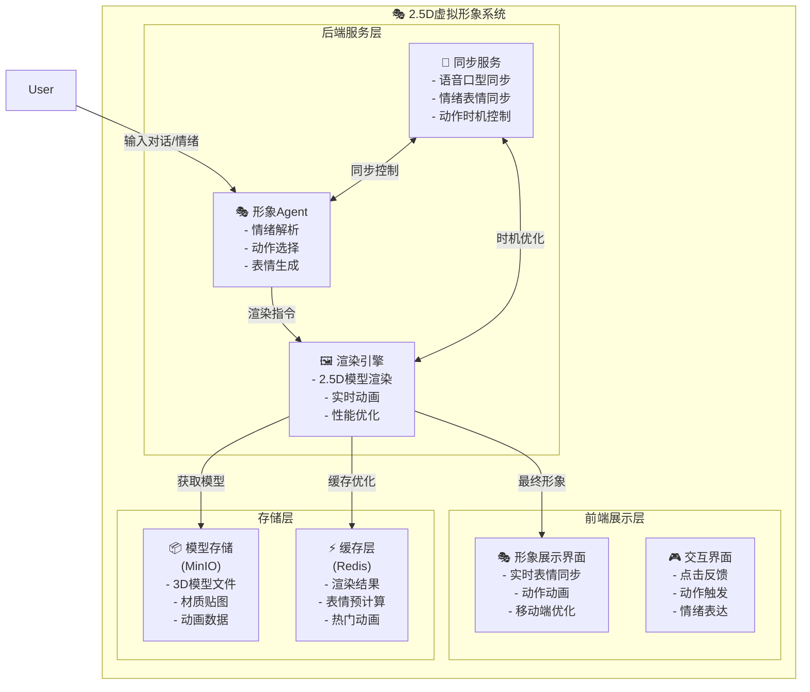
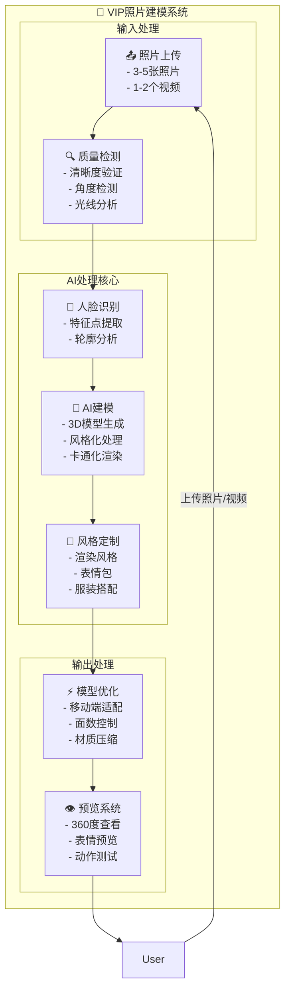
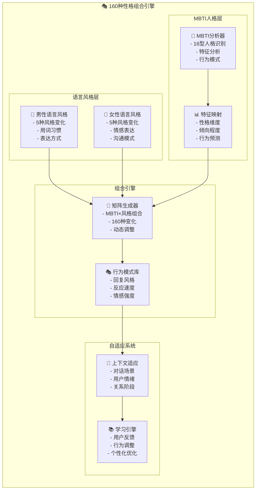
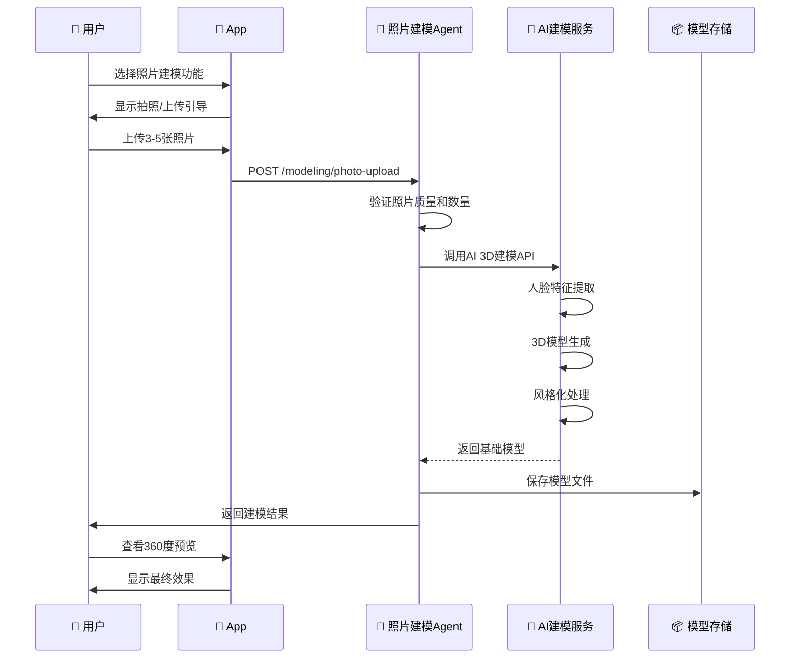
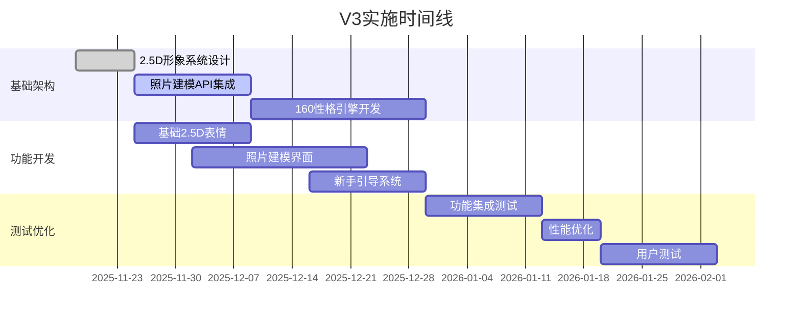

202511182025
Status: #design
Tags: [[AI伴侣]] [[Agent架构]]

# AI伴侣Agent完整架构设计 V3.0

## 文档版本控制

| 作者 | 日期 | 版本 | 描述 |
|------|------|------|------|
| AI架构师 | 2025/11/18 | 3.0 | 基于原型需求升级架构，增加2.5D形象、照片建模、160性格组合等核心功能 |
| AI架构师 | 2025/11/08 | 2.0 | 完整架构设计,基于Agent设计模式优化 |

---

## 目录

1. [架构设计原则](#架构设计原则)
2. [系统总体架构](#系统总体架构)
3. [核心模块设计](#核心模块设计)
4. [业务流程设计](#业务流程设计)
5. [数据架构设计](#数据架构设计)
6. [安全与合规设计](#安全与合规设计)
7. [性能与成本优化](#性能与成本优化)
8. [技术选型](#技术选型)
9. [V3新增核心功能](#v3新增核心功能)

---

## 架构设计原则

基于Agent设计模式的核心原则:

### 1. 清晰胜于聪慧 (Clarity over Cleverness)
- 所有Prompt、工具描述必须极度清晰、无歧义
- 人格定义、安全边界用详尽语言描述
- 避免让AI"猜测"用户意图

### 2. 结构决定行为 (Structure Dictates Behavior)
- 通过结构化输出(JSON Schema)规范Agent行为
- 使用明确的状态机管理对话流程
- 通过工具接口定义能力边界

### 3. 万物皆为工具 (Everything is a Tool)
- 记忆操作、情绪识别、危机检测都封装为工具
- Agent通过工具调用实现能力扩展
- 工具可独立测试、替换、升级

### 4. 迭代与评估是唯一通路 (Iteration & Evaluation)
- 建立黄金评测集和自动化回归测试
- 从用户反馈(点踩)中持续学习
- 双轨制开发:同步路径求快,异步路径求好

---

## 系统总体架构

### 架构全景图

```mermaid
graph TD
    %% --- 样式定义 ---
    classDef client fill:#e0f2fe,stroke:#0284c7,stroke-width:2px,color:#000;
    classDef gateway fill:#fef3c7,stroke:#f59e0b,stroke-width:2px,color:#000;
    classDef router fill:#ddd6fe,stroke:#7c3aed,stroke-width:2px,color:#000;
    classDef sync fill:#d1fae5,stroke:#10b981,stroke-width:2px,color:#000;
    classDef async fill:#fbcfe8,stroke:#ec4899,stroke-width:2px,color:#000;
    classDef agent fill:#fecaca,stroke:#dc2626,stroke-width:3px,color:#000;
    classDef memory fill:#fed7aa,stroke:#ea580c,stroke-width:2px,color:#000;
    classDef safe fill:#fca5a5,stroke:#b91c1c,stroke-width:2px,color:#000;
    classDef trigger fill:#c4b5fd,stroke:#8b5cf6,stroke-width:2px,color:#000;
    classDef v3 fill:#f0abfc,stroke:#a21caf,stroke-width:3px,color:#000;

    %% --- 客户端层 ---
    subgraph Client ["🎨 客户端层 (iOS/Android)"]
        User["👤 用户界面"]
        Avatar_UI["🎭 2.5D虚拟形象界面"]
        Memory_UI["💭 记忆管理界面"]
        Creation_UI["🛠️ 角色创建界面"]
        Settings["⚙️ 设置中心"]
    end
    class Client,User,Avatar_UI,Memory_UI,Creation_UI,Settings client;

    %% --- API网关层 ---
    GW["🚪 API网关<br/>- 鉴权/限流<br/>- 日志埋点<br/>- 🚨输入安全预检(危机信号检测)"]
    Crisis_Template["⚠️ 危机干预模板库<br/>- 自杀危机资源<br/>- 心理援助热线<br/>- 无需LLM调用"]
    class GW gateway;
    class Crisis_Template safe;

    %% --- 智能路由层 (新增核心) ---
    Router["🧭 智能路由器<br/>- 意图识别<br/>- 模式切换<br/>- 流量分发<br/>- VIP权限检测"]
    class Router router;

    %% --- 同步处理层 (实时响应 <1.5s) ---
    subgraph Sync_Layer ["⚡ 同步层 (实时响应 p95<1.5s)"]
        direction TB

        subgraph Fast_Path ["🏃 快速通道 (简单对话 <500ms)"]
            E_Sensor1["👁️ 情感传感器-快速版<br/>- 基础情绪识别<br/>- 输出: 情绪标签"]
            Simple_Chat["💬 基础对话Agent<br/>- 小模型(qwen-turbo)<br/>- 模板缓存<br/>- 接收情绪标签"]
        end

        subgraph Smart_Path ["🧠 智能通道 (复杂任务 <1.5s)"]
            E_Sensor2["👁️ 情感传感器-智能版<br/>- 深度情绪分析<br/>- 输出: 多维情绪+建议策略"]
            Orchestrator["🎯 编排器 (O)<br/>- 接收情绪策略<br/>- Planning规划<br/>- 工具调用编排<br/>- 任务分解"]
            Tools["🔧 工具库<br/>- 记忆查询工具<br/>- 危机检测工具<br/>- 情绪安抚策略库<br/>- 天气/新闻API"]
            Memory_Fast["📦 快速记忆<br/>(Redis缓存)"]
            E_Chat["💎 情感对话Agent<br/>- 人格驱动<br/>- 情绪自适应<br/>- 共情回复生成"]
        end

        subgraph VIP_Agents ["👑 VIP专属Agent"]
            EC_Agent["🩺 情感教练Agent<br/>(基于CBT理论)"]
            IM_Agent["💕 亲密模式Agent<br/>(有安全边界)"]
            Avatar_Agent["🎭 2.5D形象Agent<br/>(表情同步+动作)"]
            Modeling_Agent["📸 照片建模Agent<br/>(VIP专属3D建模)"]
        end

        Critic["🔍 评审员 (C)<br/>- 内容质量检查<br/>- 上下文一致性<br/>- 轻量级SLM"]

        Safety["🛡️ 双层安全<br/>- 敏感词过滤<br/>- 区域策略<br/>- 合规检查"]
    end
    class Sync_Layer,Fast_Path,Smart_Path sync;
    class E_Sensor1,E_Sensor2,Orchestrator,E_Chat,EC_Agent,IM_Agent,Avatar_Agent,Modeling_Agent,Critic agent;
    class Tools,Memory_Fast memory;
    class Safety safe;

    %% --- 异步处理层 (高质量智能) ---
    subgraph Async_Layer ["🌙 异步层 (后台智能处理)"]
        direction TB
        Queue["📨 消息队列<br/>(RabbitMQ/Redis)"]

        subgraph Async_Workers ["🔬 后台专家团队"]
            Memory_Analyst["🧠 记忆分析师<br/>- 对话总结<br/>- 关键信息提取<br/>- 知识图谱构建"]
            Reflection_Agent["🪞 反思Agent<br/>- 人设一致性检查<br/>- 回复质量评估<br/>- 改进建议生成"]
            Goal_Tracker["🎯 目标追踪器<br/>- 长期目标管理<br/>- 进度评估<br/>- 里程碑提醒"]
            Error_Corrector["🔧 纠错处理器<br/>- 记忆修正<br/>- 污染数据清理"]
            Avatar_Generator["🎭 2.5D形象生成器<br/>- 表情动画<br/>- 动作合成<br/>- 实时渲染"]
            Personality_Engine["🎭 160种性格引擎<br/>- MBTI×语言风格<br/>- 动态人格匹配<br/>- 行为模式生成"]
        end
    end
    class Async_Layer,Queue async;
    class Memory_Analyst,Reflection_Agent,Goal_Tracker,Error_Corrector,Avatar_Generator,Personality_Engine agent;
    class Avatar_Generator,Personality_Engine v3;

    %% --- 主动触发系统 ---
    subgraph Proactive_System ["⏰ 主动关怀系统"]
        Time_Trigger["⏰ 定时触发<br/>(早晚问候)"]
        Event_Trigger["🎉 事件触发<br/>(纪念日/里程碑)"]
        Emotion_Trigger["💔 情绪触发<br/>(连续未聊天/危机)"]
        Goal_Trigger["📊 目标触发<br/>(周回顾/月总结)"]
        Guide_Trigger["🎓 新手引导触发<br/>(萌教官NPC)"]
    end
    class Proactive_System,Time_Trigger,Event_Trigger,Emotion_Trigger,Goal_Trigger,Guide_Trigger trigger;
    class Guide_Trigger v3;

    %% --- 记忆引擎 (核心) ---
    subgraph Memory_Engine ["🧠 记忆引擎 (四层架构)"]
        direction LR
        Short_Memory["⚡ 短期记忆<br/>(Redis)<br/>- 会话上下文<br/>- 24小时内"]
        Long_Memory["📚 长期记忆<br/>(pgvector)<br/>- 事实/偏好<br/>- RAG检索"]
        Graph_Memory["🕸️ 关系图谱<br/>(Neo4j)<br/>- 人物关系<br/>- 事件时间线"]
        Avatar_Memory["🎭 形象记忆<br/>(MinIO)<br/>- 2.5D模型<br/>- 表情动画<br/>- 照片建模数据"]
    end
    class Memory_Engine,Short_Memory,Long_Memory,Graph_Memory,Avatar_Memory memory;
    class Avatar_Memory v3;

    %% --- VIP专属服务 (V3新增) ---
    subgraph VIP_Services ["👑 VIP专属服务"]
        direction TB

        subgraph Avatar_System ["🎭 2.5D虚拟形象系统"]
            Avatar_Engine["🎭 形象引擎<br/>- 实时表情同步<br/>- 动作捕捉<br/>- 情绪表达动画"]
            Photo_Modeling["📸 照片建模服务<br/>- AI 3D建模<br/>- 风格化处理<br/>- 模型微调"]
            Avatar_Render["🖼️ 渲染服务<br/>- 移动端适配<br/>- 流畅动画<br/>- 低延迟优化"]
        end

        subgraph Personality_System ["🎭 160种性格系统"]
            MBTI_Engine["🧠 MBTI分析引擎<br/>- 16型人格识别<br/>- 性格特征匹配"]
            Style_Engine["💬 语言风格引擎<br/>- 男性5种×女性5种<br/>- 160种组合"]
            Behavior_Generator["🎭 行为生成器<br/>- 基于人格的回复<br/>- 动态行为调整"]
        end

        subgraph Onboarding_System ["🎓 新用户引导系统"]
            Guide_NPC["萌教官NPC<br/>- 分步骤教学<br/>- 交互式引导<br/>- 功能介绍"]
            Tutorial_Flow["引导流程管理<br/>- 进度追踪<br/>- 个性化引导"]
            Welcome_Wizard["欢迎向导<br/>- 首次体验优化<br/>- 快速上手"]
        end
    end
    class VIP_Services,Avatar_System,Personality_System,Onboarding_System v3;

    %% --- 数据与监控层 ---
    subgraph Data_Layer ["📊 数据与监控层"]
        Analytics["📈 分析引擎<br/>- 埋点统计<br/>- 成本监控"]
        Metrics["📉 指标监控<br/>- 响应时间<br/>- 错误率"]
        Evaluation["✅ 评测系统<br/>- 黄金测试集<br/>- 自动回归"]
    end

    %% --- 连接关系 ---

    %% 客户端到网关
    User -->|"1. 对话消息<br/>2. 形象交互请求"| GW
    Avatar_UI -->|"3. 2.5D形象请求"| GW
    Creation_UI -->|"4. 角色创建请求<br/>- 包含照片建模"| GW
    Memory_UI -->|"X. 记忆纠错"| GW
    Settings -->|"配置变更"| GW

    %% 危机信号特殊路径 (最高优先级)
    GW -.->|"🚨检测到危机信号<br/>(想死/自杀)"| Crisis_Template
    Crisis_Template -.->|"<500ms直接返回<br/>不经过任何Agent"| User

    %% 网关到路由
    GW -->|"(VIP权限检测)"| Router

    %% 路由分发
    Router -->|"3a. 简单闲聊"| Fast_Path
    Router -->|"3b. 复杂任务"| Smart_Path
    Router -->|"3c. VIP功能(V3)"| VIP_Agents
    Router -->|"3d. 2.5D形象请求"| Avatar_Agent
    Router -->|"3e. 照片建模请求"| Modeling_Agent

    %% VIP专属服务连接
    Avatar_Agent <--> VIP_Services
    Modeling_Agent <--> Photo_Modeling
    Router -->|"新用户首次使用"| Guide_Trigger

    %% 快速通道 (简单问候/基础对话)
    E_Sensor1 -->|"情绪标签<br/>(开心/悲伤/平静)"| Simple_Chat
    Simple_Chat -->|"快速回复"| Critic

    %% 智能通道 (情绪倾诉/记忆查询/复杂任务)
    E_Sensor2 -->|"多维情绪分析<br/>(焦虑:0.8+建议策略)"| Orchestrator
    Orchestrator <-->|"调用工具"| Tools
    Orchestrator <-->|"读取最近记忆"| Memory_Fast
    Memory_Fast <-->|"检索长期记忆"| Memory_Engine
    Orchestrator -->|"传递情绪+上下文"| E_Chat
    E_Chat -->|"情绪自适应回复"| Critic

    %% VIP通道
    Router --> EC_Agent
    Router --> IM_Agent
    Router --> Avatar_Agent
    Router --> Modeling_Agent
    EC_Agent --> Critic
    IM_Agent --> Critic
    Avatar_Agent <--> Avatar_Engine
    Modeling_Agent <--> Photo_Modeling

    %% 质检和安全
    Critic -->|"✅ 通过"| Safety
    Critic -->|"❌ 驳回重做"| Orchestrator
    Safety -->|"🔒 最终安全检查"| GW
    GW -->|"10. 返回回复"| User
    GW -->|"11. 返回2.5D形象"| Avatar_UI

    %% 异步路径
    E_Chat -.->|"写入聊天记录"| Queue
    VIP_Agents -.->|"写入VIP对话记录"| Queue
    Queue -.-> Memory_Analyst
    Queue -.-> Reflection_Agent
    Queue -.-> Error_Corrector
    Queue -.-> Avatar_Generator
    Queue -.-> Personality_Engine
    Memory_Analyst -.-> Memory_Engine
    Goal_Tracker -.-> Memory_Engine

    %% 主动触发
    Time_Trigger -.-> Queue
    Event_Trigger -.-> Queue
    Emotion_Trigger -.-> Queue
    Goal_Trigger -.-> Queue
    Guide_Trigger -.-> Onboarding_System

    %% 纠错路径
    Memory_UI -.->|"纠错请求"| Queue
    Queue -.-> Error_Corrector

    %% 监控路径
    GW -.-> Analytics
    Orchestrator -.-> Metrics
    E_Chat -.-> Evaluation
    VIP_Services -.-> Analytics
```



### V3核心新增功能架构

#### 1. 2.5D虚拟形象系统


#### 2. 照片建模VIP服务


#### 3. 160种性格组合引擎


---

## 核心模块设计

### 模块1: 智能路由器 (Router) - V3增强

**核心职责**: 意图识别与流量分发，新增VIP权限检测和2.5D形象路由

#### 1.1 增强路由决策树

```python
class RouterDecisionV3:
    """V3增强路由决策引擎"""

    def route(self, user_input: str, context: ContextV3) -> Route:
        # Step 0: VIP权限检测 (新增)
        if not self.check_vip_permission(context.request):
            return Route.FEATURE_LOCKED

        # Step 1: 危机优先 (保持)
        if self.is_crisis(user_input):
            return Route.CRISIS_INTERVENTION

        # Step 2: 新手引导检测 (新增)
        if context.user.is_new_user:
            return Route.ONBOARDING_FLOW

        # Step 3: 2.5D形象请求检测 (新增)
        if self.is_avatar_request(user_input, context):
            return Route.AVATAR_GENERATION

        # Step 4: 照片建模请求检测 (新增)
        if self.is_photo_modeling_request(user_input, context):
            return Route.PHOTO_MODELING

        # Step 5: VIP模式检测 (增强)
        if context.user.is_vip:
            if self.detect_counseling_intent(user_input):
                return Route.EMOTIONAL_COACH
            if context.current_mode == "intimacy":
                return Route.INTIMACY_MODE
            if self.detect_personality_customization(user_input):
                return Route.PERSONALITY_SETUP

        # Step 6: 复杂度评估 (保持)
        complexity = self.assess_complexity(user_input)
        if complexity == "simple":
            return Route.FAST_CHAT
        elif complexity == "complex":
            return Route.ORCHESTRATOR
        else:
            return Route.SMART_CHAT

    def check_vip_permission(self, request: Request) -> bool:
        """检查VIP功能权限"""
        vip_features = [
            "photo_modeling", "intimacy_mode", "premium_avatar",
            "personality_customization", "advanced_memory"
        ]

        for feature in vip_features:
            if feature in request.features and not request.user.is_vip:
                return False
        return True

    def is_avatar_request(self, text: str, context: ContextV3) -> bool:
        """检测2.5D形象相关请求"""
        avatar_keywords = [
            "表情", "动作", "形象", "动画",
            "做一个...表情", "表演", "跳舞", "唱歌"
        ]
        return any(keyword in text for keyword in avatar_keywords)

    def is_photo_modeling_request(self, text: str, context: ContextV3) -> bool:
        """检测照片建模请求"""
        modeling_keywords = [
            "上传照片", "建模", "根据我的照片", "定制形象",
            "3D模型", "照片生成", "AI建模"
        ]
        return any(keyword in text for keyword in modeling_keywords)
```

#### 1.2 V3增强路由策略表

| 用户输入类型 | 关键词/模式 | 路由目标 | 预期延迟 | VIP等级要求 | 架构图流转路径 |
|------------|-----------|---------|---------|-----------|---------------|
| 简单问候 | "早安"、"晚安"、"在吗" | Fast_Chat | <300ms | 免费 | `GW → Router → Fast_Path(E_Sensor1 → Simple_Chat) → Critic → Safety → GW` |
| 情绪倾诉 | "我好累"、"心情不好" | Smart_Chat + 情感传感器 | <1s | 免费 | `GW → Router → Smart_Path(E_Sensor2 → Orchestrator → E_Chat) → Critic → Safety → GW` |
| 2.5D形象请求 | "做个表情"、"跳舞"、"唱歌" | Avatar_Agent + 形象引擎 | <800ms | VIP基础 | `GW → Router(检测VIP) → Avatar_Agent → Avatar_Engine → Render_Engine → GW` |
| 照片建模请求 | "上传照片建模"、"定制形象" | Photo_Modeling_Agent | <5s | VIP高级 | `GW → Router(检测VIP) → Modeling_Agent → Photo_Modeling → Preview_System → GW` |
| 性格定制 | "我想改变性格"、"160种性格" | Personality_Engine | <1s | VIP基础 | `GW → Router → Personality_Engine → MBTI×Style_Matrix → Behavior_Pattern → GW` |
| 新手引导 | 首次使用用户 | Onboarding_Flow | 实时 | 免费 | `GW → Router(检测新用户) → Guide_Trigger → Onboarding_System →萌教官NPC → GW` |
| 心理咨询(VIP) | "我很焦虑"、"我抑郁了" | Emotional_Coach_Agent | <2s | VIP基础 | `GW → Router(检测VIP+心理咨询意图) → VIP_Agents(EC_Agent ↔ CBT知识库) → Critic → Safety → GW` |
| 亲密模式(VIP) | 特定触发词 + 18+验证 | Intimacy_Mode_Agent | <2s | VIP高级 | `GW → Router(检测VIP+亲密模式+年龄验证) → VIP_Agents(IM_Agent) → Critic → Safety → GW` |
| 记忆查询 | "我姐姐叫什么"、"你记得..." | Orchestrator + RAG | <1.5s | 免费 | `GW → Router → Smart_Path(E_Sensor2 → Orchestrator ↔ Memory_Fast ↔ Memory_Engine → E_Chat) → Critic → Safety → GW` |
| 复杂任务 | "帮我计划..."、"提醒我..." | Orchestrator + Planning | <2s | 免费 | `GW → Router → Smart_Path(Orchestrator ↔ Tools + Memory_Fast → E_Chat) → Critic → Safety → GW` |
| 危机信号 | "想死"、"自杀"、"伤害" | 紧急干预流程 | <500ms | 免费 | `GW(输入安全检查检测到危机) → Router(优先级最高) → 跳过所有Agent → 直接返回危机干预资源` |

### 模块2: 2.5D虚拟形象Agent (Avatar_Agent) - V3新增

**核心职责**: 2.5D虚拟形象的表情同步、动作生成和情绪表达

```python
class AvatarAgentV3:
    """V3新增2.5D虚拟形象Agent"""

    def __init__(self):
        self.emotion_mapper = EmotionToAvatarMapper()
        self.render_engine = AvatarRenderEngine()
        self.sync_service = AvatarSyncService()

    def process_emotion_request(self,
                                user_input: str,
                                emotion_result: EmotionResult,
                                personality: PersonalityConfig) -> AvatarResponse:
        """处理情绪驱动的形象生成请求"""

        # Step 1: 解析用户意图
        intent = self.parse_avatar_intent(user_input)

        # Step 2: 情绪到表情映射
        avatar_emotion = self.emotion_mapper.map_emotion_to_avatar(
            emotion_result.primary_emotion,
            emotion_result.intensity
        )

        # Step 3: 选择动作模板
        action_template = self.select_action_template(intent, avatar_emotion)

        # Step 4: 生成动画序列
        animation_sequence = self.generate_animation_sequence(
            avatar_emotion,
            action_template,
            personality
        )

        # Step 5: 渲染2.5D形象
        rendered_avatar = self.render_engine.render_2d5_avatar(
            animation_sequence,
            user_settings=personality.avatar_settings
        )

        return AvatarResponse(
            animation_url=rendered_avatar.url,
            duration=rendered_avatar.duration,
            emotion=avatar_emotion,
            action=action_template.name
        )

    def parse_avatar_intent(self, text: str) -> AvatarIntent:
        """解析用户对形象的意图"""
        intent_patterns = {
            "dance": ["跳舞", "舞蹈", "dance", "跳个舞"],
            "sing": ["唱歌", "唱首歌", "sing", "来首歌"],
            "expression": ["做个表情", "笑脸", "哭脸", "生气", "惊讶"],
            "action": ["招手", "点头", "摇头", "鼓掌", "飞吻"],
            "celebration": ["庆祝", "开心", "太棒了", "成功了"]
        }

        for intent, keywords in intent_patterns.items():
            if any(keyword in text for keyword in keywords):
                return AvatarIntent(type=intent, confidence=0.8)

        return AvatarIntent(type="auto_emotion", confidence=0.6)

class EmotionToAvatarMapper:
    """情绪到虚拟形象表情映射器"""

    def __init__(self):
        self.emotion_mapping = {
            "开心": {
                "intensity_high": {"expression": "大笑", "action": "跳跃"},
                "intensity_medium": {"expression": "微笑", "action": "点头"},
                "intensity_low": {"expression": "浅笑", "action": "眨眼"}
            },
            "悲伤": {
                "intensity_high": {"expression": "哭泣", "action": "擦眼泪"},
                "intensity_medium": {"expression": "难过", "action": "低头"},
                "intensity_low": {"expression": "失落", "action": "叹气"}
            },
            "愤怒": {
                "intensity_high": {"expression": "愤怒", "action": "跺脚"},
                "intensity_medium": {"expression": "生气", "action": "叉腰"},
                "intensity_low": {"expression": "不悦", "action": "皱眉"}
            },
            "惊讶": {
                "intensity_high": {"expression": "震惊", "action": "后退"},
                "intensity_medium": {"expression": "惊讶", "action": "捂嘴"},
                "intensity_low": {"expression": "好奇", "action": "歪头"}
            }
        }

    def map_emotion_to_avatar(self, emotion: str, intensity: float) -> AvatarEmotion:
        """将情绪映射到虚拟形象表情"""
        if emotion not in self.emotion_mapping:
            return AvatarEmotion(expression="中性", action="静止")

        intensity_level = self._get_intensity_level(intensity)
        mapping = self.emotion_mapping[emotion][intensity_level]

        return AvatarEmotion(
            expression=mapping["expression"],
            action=mapping["action"],
            intensity=intensity
        )

    def _get_intensity_level(self, intensity: float) -> str:
        """获取情绪强度等级"""
        if intensity >= 0.7:
            return "intensity_high"
        elif intensity >= 0.4:
            return "intensity_medium"
        else:
            return "intensity_low"
```

### 模块3: 照片建模Agent (PhotoModeling_Agent) - V3新增

**核心职责**: VIP专属的AI照片建模服务

```python
class PhotoModelingAgentV3:
    """V3新增照片建模Agent"""

    def __init__(self):
        self.face_recognition = FaceRecognitionService()
        self.model_generator = AIModelGenerator()
        self.style_processor = StyleProcessor()
        self.quality_checker = ModelQualityChecker()

    async def process_photo_modeling_request(self,
                                            user_id: str,
                                            photos: List[bytes],
                                            videos: List[bytes],
                                            style_preference: StylePreference) -> ModelingResult:
        """处理照片建模请求"""

        # Step 1: 输入验证和质量检查
        validation_result = await self.validate_input(photos, videos)
        if not validation_result.is_valid:
            return ModelingResult(error=validation_result.error)

        # Step 2: 人脸特征提取
        face_features = await self.extract_face_features(photos, videos)

        # Step 3: AI生成3D模型
        base_model = await self.model_generator.generate_3d_model(face_features)

        # Step 4: 风格化处理
        styled_model = await self.style_processor.apply_style(
            base_model,
            style_preference
        )

        # Step 5: 模型优化和压缩
        optimized_model = await self.optimize_for_mobile(styled_model)

        # Step 6: 质量检查
        quality_score = await self.quality_checker.evaluate(optimized_model)

        # Step 7: 生成预览
        preview_urls = await self.generate_previews(optimized_model)

        # Step 8: 保存到存储
        model_info = await self.save_model(
            user_id=user_id,
            model=optimized_model,
            metadata={
                "style": style_preference.name,
                "quality_score": quality_score,
                "created_at": datetime.now()
            }
        )

        return ModelingResult(
            model_id=model_info.id,
            preview_urls=preview_urls,
            quality_score=quality_score,
            estimated_render_time=model_info.render_time
        )

    async def validate_input(self, photos: List[bytes], videos: List[bytes]) -> ValidationResult:
        """验证输入数据质量"""
        # 检查数量要求
        photo_count = len(photos)
        video_count = len(videos)

        if photo_count < 3 and video_count < 1:
            return ValidationResult(
                is_valid=False,
                error="需要至少3张照片或1个视频"
            )

        # 检查文件大小和格式
        for i, photo in enumerate(photos):
            if len(photo) > 10 * 1024 * 1024:  # 10MB限制
                return ValidationResult(
                    is_valid=False,
                    error=f"照片{i+1}超过大小限制(10MB)"
                )

        # 检查图片质量
        quality_scores = []
        for photo in photos:
            quality = await self.assess_image_quality(photo)
            quality_scores.append(quality)

        avg_quality = sum(quality_scores) / len(quality_scores)
        if avg_quality < 0.6:
            return ValidationResult(
                is_valid=False,
                error="照片质量偏低，请提供更清晰的照片"
            )

        return ValidationResult(is_valid=True)

    async def extract_face_features(self, photos: List[bytes], videos: List[bytes]) -> FaceFeatures:
        """提取人脸特征"""
        all_face_data = []

        # 处理照片
        for photo in photos:
            face_data = await self.face_recognition.extract_features(photo)
            all_face_data.append(face_data)

        # 处理视频
        for video in videos:
            frames = await self.extract_video_frames(video)
            for frame in frames:
                face_data = await self.face_recognition.extract_features(frame)
                all_face_data.append(face_data)

        # 特征融合和优化
        merged_features = self.merge_face_features(all_face_data)

        return merged_features

    async def generate_previews(self, model: OptimizedModel) -> List[str]:
        """生成模型预览图"""
        preview_angles = [
            {"rotation": 0, "expression": "neutral"},
            {"rotation": 45, "expression": "smile"},
            {"rotation": 90, "expression": "surprise"},
            {"rotation": 180, "expression": "neutral"},
            {"rotation": 270, "expression": "happy"}
        ]

        preview_urls = []
        for angle_config in preview_angles:
            preview = await self.render_preview(model, angle_config)
            preview_urls.append(preview.url)

        return preview_urls

class AIModelGenerator:
    """AI模型生成器"""

    def __init__(self):
        self.model_type = "deepseek-vl"  # 多模态大模型

    async def generate_3d_model(self, face_features: FaceFeatures) -> BaseModel:
        """使用AI生成3D模型"""

        prompt = f"""
        基于以下人脸特征生成3D虚拟形象模型:

        人脸特征数据:
        - 面部轮廓: {face_features.contour}
        - 五官位置: {face_features.landmarks}
        - 皮肤特征: {face_features.skin_tone}
        - 特殊标记: {face_features.special_features}

        生成要求:
        1. 保持面部特征相似度80%以上
        2. 适合2.5D卡通化风格
        3. 表情丰富，支持基础情绪表达
        4. 模型面数控制在5000以内

        请生成3D模型数据(JSON格式)。
        """

        model_data = await self.model_type.generate(prompt)
        return BaseModel.from_json(model_data)
```

### 模块4: 160种性格引擎 (Personality_Engine) - V3新增

**核心职责**: MBTI 16型人格 × 10种语言风格 = 160种性格组合

```python
class PersonalityEngineV3:
    """V3新增160种性格引擎"""

    def __init__(self):
        self.mbti_analyzer = MBTIAnalyzer()
        self.style_analyzer = LanguageStyleAnalyzer()
        self.combination_matrix = PersonalityCombinationMatrix()
        self.behavior_generator = BehaviorGenerator()

    def generate_personality_profile(self,
                                    mbti_type: str,
                                    language_style: str,
                                    context: Optional[Dict] = None) -> PersonalityProfile:
        """生成完整的人格档案"""

        # Step 1: MBTI特征分析
        mbti_traits = self.mbti_analyzer.analyze_type(mbti_type)

        # Step 2: 语言风格分析
        style_traits = self.style_analyzer.analyze_style(language_style)

        # Step 3: 生成160种组合档案
        combination_profile = self.combination_matrix.generate_combination(
            mbti_traits,
            style_traits
        )

        # Step 4: 行为模式生成
        behavior_patterns = self.behavior_generator.generate_patterns(
            combination_profile,
            context
        )

        # Step 5: 对话风格定制
        dialogue_style = self.generate_dialogue_style(combination_profile)

        return PersonalityProfile(
            mbti_type=mbti_type,
            language_style=language_style,
            traits=combination_profile,
            behavior_patterns=behavior_patterns,
            dialogue_style=dialogue_style,
            combination_id=f"{mbti_type}_{language_style}"
        )

    def generate_dialogue_style(self, profile: CombinationProfile) -> DialogueStyle:
        """生成基于人格组合的对话风格"""

        base_style = {
            "formality_level": self._calculate_formality(profile),
            "emotion_expression": self._calculate_emotion_level(profile),
            "response_length": self._calculate_response_length(profile),
            "question_frequency": self._calculate_question_frequency(profile),
            "humor_level": self._calculate_humor_level(profile),
            "metaphor_usage": self._calculate_metaphor_usage(profile),
            "emoji_usage": self._calculate_emoji_usage(profile)
        }

        return DialogueStyle(**base_style)

class MBTIAnalyzer:
    """MBTI人格分析器"""

    def __init__(self):
        self.trait_definitions = {
            "E": {"name": "外向", "energy": "external", "social": "high"},
            "I": {"name": "内向", "energy": "internal", "social": "low"},
            "S": {"name": "感觉", "perception": "concrete", "focus": "present"},
            "N": {"name": "直觉", "perception": "abstract", "focus": "future"},
            "T": {"name": "思考", "decision": "logic", "style": "analytical"},
            "F": {"name": "情感", "decision": "values", "style": "empathetic"},
            "J": {"name": "判断", "lifestyle": "structured", "planning": "high"},
            "P": {"name": "感知", "lifestyle": "flexible", "planning": "low"}
        }

    def analyze_type(self, mbti_type: str) -> MBTITraits:
        """分析MBTI类型特征"""
        traits = {}

        for i, letter in enumerate(mbti_type):
            if letter in self.trait_definitions:
                dimension = ["EI", "SN", "TF", "JP"][i]
                traits[dimension] = self.trait_definitions[letter]

        # 计算综合特征
        social_tendency = self._calculate_social_tendency(traits)
        cognitive_style = self._calculate_cognitive_style(traits)
        decision_pattern = self._calculate_decision_pattern(traits)

        return MBTITraits(
            type=mbti_type,
            dimensions=traits,
            social_tendency=social_tendency,
            cognitive_style=cognitive_style,
            decision_pattern=decision_pattern
        )

class LanguageStyleAnalyzer:
    """语言风格分析器"""

    def __init__(self):
        self.style_definitions = {
            "male_cool": {
                "name": "男性冷酷风",
                "characteristics": ["简洁", "理性", "少感情词", "直接"],
                "vocabulary": ["技术词汇", "逻辑连接词", "专业术语"],
                "sentence_structure": "短句为主，逻辑清晰"
            },
            "male_warm": {
                "name": "男性温暖风",
                "characteristics": ["温和", "体贴", "幽默", "包容"],
                "vocabulary": ["生活词汇", "情感表达", "鼓励词汇"],
                "sentence_structure": "长短结合，亲切自然"
            },
            "male_professional": {
                "name": "男性专业风",
                "characteristics": ["严谨", "专业", "权威", "有条理"],
                "vocabulary": ["专业术语", "逻辑词汇", "分析词汇"],
                "sentence_structure": "结构完整，逻辑严密"
            },
            "male_playful": {
                "name": "男性活泼风",
                "characteristics": ["活泼", "幽默", "爱开玩笑", "轻松"],
                "vocabulary": ["网络流行词", "表情符号", "轻松词汇"],
                "sentence_structure": "短小精悍，节奏明快"
            },
            "male_mature": {
                "name": "男性成熟风",
                "characteristics": ["稳重", "深思熟虑", "有经验", "可靠"],
                "vocabulary": ["人生哲理", "经验词汇", "稳重表达"],
                "sentence_structure": "沉稳有力，富有哲理"
            },
            "female_gentle": {
                "name": "女性温柔风",
                "characteristics": ["温柔", "体贴", "细心", "柔软"],
                "vocabulary": ["情感词汇", "安慰词汇", "生活词汇"],
                "sentence_structure": "柔和流畅，委婉表达"
            },
            "female_lively": {
                "name": "女性活泼风",
                "characteristics": ["活泼", "开朗", "热情", "正能量"],
                "vocabulary": ["积极词汇", "生活词汇", "情感表达"],
                "sentence_structure": "节奏明快，充满活力"
            },
            "female_elegant": {
                "name": "女性优雅风",
                "characteristics": ["优雅", "知性", "有品位", "文雅"],
                "vocabulary": ["文艺词汇", "优雅表达", "文化词汇"],
                "sentence_structure": "文雅优美，富有诗意"
            },
            "female_professional": {
                "name": "女性职业风",
                "characteristics": ["专业", "干练", "独立", "果断"],
                "vocabulary": ["专业词汇", "职场词汇", "自信表达"],
                "sentence_structure": "简洁有力，条理清晰"
            },
            "female_cute": {
                "name": "女性可爱风",
                "characteristics": ["可爱", "俏皮", "撒娇", "萌系"],
                "vocabulary": ["可爱词汇", "撒娇词汇", "表情符号"],
                "sentence_structure": "短小可爱，语气词丰富"
            }
        }

    def analyze_style(self, style_name: str) -> LanguageStyle:
        """分析语言风格特征"""
        if style_name not in self.style_definitions:
            style_name = "male_warm"  # 默认风格

        definition = self.style_definitions[style_name]

        return LanguageStyle(
            name=definition["name"],
            characteristics=definition["characteristics"],
            vocabulary=definition["vocabulary"],
            sentence_structure=definition["sentence_structure"],
            style_id=style_name
        )

class PersonalityCombinationMatrix:
    """性格组合矩阵生成器"""

    def __init__(self):
        self.combination_rules = self._load_combination_rules()

    def generate_combination(self,
                           mbti_traits: MBTITraits,
                           style_traits: LanguageStyle) -> CombinationProfile:
        """生成MBTI×语言风格的组合档案"""

        # 获取组合规则
        rule_key = f"{mbti_traits.type}_{style_traits.style_id}"
        combination_rule = self.combination_rules.get(rule_key, self._get_default_rule())

        # 应用组合调整
        adjusted_traits = self._apply_combination_adjustment(
            mbti_traits,
            style_traits,
            combination_rule
        )

        # 生成行为权重
        behavior_weights = self._calculate_behavior_weights(adjusted_traits)

        # 生成对话偏好
        dialogue_preferences = self._generate_dialogue_preferences(adjusted_traits)

        return CombinationProfile(
            mbti_type=mbti_traits.type,
            language_style=style_traits.style_id,
            adjusted_traits=adjusted_traits,
            behavior_weights=behavior_weights,
            dialogue_preferences=dialogue_preferences,
            combination_strength=combination_rule["strength"]
        )

    def _load_combination_rules(self) -> Dict[str, Dict]:
        """加载160种组合的预设规则"""
        return {
            # 示例规则，实际应包含160种组合
            "INTJ_male_cool": {
                "strength": 0.9,
                "adjustments": {
                    "formality": 0.2,
                    "emotion_level": -0.3,
                    "humor_level": -0.1
                }
            },
            "ENFP_female_lively": {
                "strength": 0.95,
                "adjustments": {
                    "emotion_level": 0.4,
                    "humor_level": 0.3,
                    "question_frequency": 0.2
                }
            }
            # ... 其他158种组合规则
        }
```

### 模块5: 新用户引导系统 (Onboarding_System) - V3新增

**核心职责**: 萌教官NPC引导，分步骤教学，快速上手体验

```python
class OnboardingSystemV3:
    """V3新增新用户引导系统"""

    def __init__(self):
        self.guide_npc = GuideNPC()
        self.tutorial_flow = TutorialFlowManager()
        self.progress_tracker = OnboardingProgressTracker()

    async def start_onboarding(self, user_id: str) -> OnboardingSession:
        """开始新用户引导"""

        # Step 1: 检查用户状态
        user_state = await self.get_user_state(user_id)
        if not user_state.is_new_user:
            return OnboardingSession(error="用户已完成引导")

        # Step 2: 创建引导会话
        session = await self.create_onboarding_session(user_id)

        # Step 3: 启动萌教官NPC
        npc_response = await self.guide_npc.welcome_user(user_id)

        # Step 4: 显示欢迎界面
        welcome_message = self._generate_welcome_message(npc_response)

        return OnboardingSession(
            session_id=session.id,
            welcome_message=welcome_message,
            current_step="welcome",
            total_steps=7,
            progress=0
        )

    async def process_tutorial_step(self,
                                   session_id: str,
                                   user_input: str) -> TutorialResponse:
        """处理引导步骤"""

        # Step 1: 获取会话状态
        session = await self.get_onboarding_session(session_id)

        # Step 2: 解析用户意图
        intent = await self.parse_user_intent(user_input, session.current_step)

        # Step 3: 执行对应步骤
        if intent.action == "next_step":
            response = await self.advance_to_next_step(session)
        elif intent.action == "repeat_explanation":
            response = await self.repeat_current_explanation(session)
        elif intent.action == "skip_tutorial":
            response = await self.skip_tutorial(session)
        else:
            response = await self.handle_step_interaction(session, user_input)

        # Step 4: 更新进度
        await self.progress_tracker.update_progress(session.id, response.step_completed)

        return response

class GuideNPC:
    """萌教官NPC引导器"""

    def __init__(self):
        self.personality = self._create_guide_personality()
        self.tutorial_scripts = self._load_tutorial_scripts()

    def _create_guide_personality(self) -> PersonalityConfig:
        """创建萌教官人格配置"""
        return PersonalityConfig(
            name="萌教官",
            personality_type="ESFJ_female_gentle",  # 温柔体贴型
            avatar_style="cute_tutor",
            speaking_style={
                "tone": "温柔耐心",
                "pace": "适中",
                "emoji_usage": "moderate",
                "encouragement_frequency": "high"
            }
        )

    async def welcome_user(self, user_id: str) -> NPCResponse:
        """萌教官欢迎用户"""

        welcome_script = """
        欢迎来到小暖陪伴的魔法世界！🌟

        我是萌教官，你的专属向导~ ✨

        在接下来的几分钟里，我会带你了解这个温暖的世界：

        🎭 你可以创建属于自己的AI伴侣
        💫 与TA进行有温度的对话
        🎨 看到TA生动的2.5D形象
        💕 培养独一无二的感情

        准备好了吗？让我们开始这段奇妙的旅程吧！

        (回复"开始"来继续，或者问我"能做什么？"了解更多功能~)
        """

        return NPCResponse(
            message=welcome_script,
            avatar_emotion="excited",
            avatar_action="wave_hand",
            next_step_hint="start_tutorial",
            quick_replies=["开始", "能做什么？", "跳过引导"]
        )

    async def explain_feature(self, feature_name: str) -> NPCResponse:
        """萌教官解释功能"""

        feature_scripts = {
            "character_creation": """
            ✨ 角色创建功能介绍 ✨

            在这里，你可以：

            🎭 选择预设角色模板：
            • 温柔御姐、霸道总裁、清纯女大...
            • 超过10种性格任你选择！

            📸 VIP专属定制：
            • 上传你的照片，AI为你建模
            • 打造独一无二的虚拟形象

            🎨 性格定制：
            • 160种性格组合
            • MBTI × 语言风格 = 完美匹配

            想要创建什么样的伴侣呢？(≧∇≦)ﾉ
            """,

            "avatar_interaction": """
            🎭 2.5D形象互动介绍 🎭

            你的AI伴侣不只是文字哦~

            💫 实时表情：TA会根据对话内容展现不同表情
            🎪 生动作图：开心时会跳舞，难过时会轻声安慰
            🎨 精美动画：每个表情都经过精心设计

            VIP用户还能：
            📸 上传照片定制专属形象
            🎬 让TA为你表演特定动作

            想看看TA的表演吗？试试说"给我跳个舞"~ 💃
            """,

            "personality_system": """
            🧠 160种性格系统 🧠

            我们为每个AI伴侣都注入了独特的"灵魂"：

            📊 MBTI 16型人格：
            • 内向/外向、感觉/直觉...
            • 科学的性格理论基础

            💬 10种语言风格：
            • 男性5种：冷酷/温暖/专业/活泼/成熟
            • 女性5种：温柔/活泼/优雅/职业/可爱

            🎯 智能组合：
            • 16 × 10 = 160种独特性格
            • 每一种都有独特的说话方式和行为模式

            你想要什么性格的伴侣呢？(๑•̀ㅂ•́)و✧
            """
        }

        script = feature_scripts.get(feature_name, "这个功能我还在学习中呢~")

        return NPCResponse(
            message=script,
            avatar_emotion="helpful",
            avatar_action="explain",
            next_step_hint="continue_tutorial",
            quick_replies=["我明白了", "还有其他功能吗？", "进入下一步"]
        )

class TutorialFlowManager:
    """引导流程管理器"""

    def __init__(self):
        self.tutorial_steps = [
            {
                "id": "welcome",
                "name": "欢迎介绍",
                "description": "萌教官自我介绍和产品概述",
                "required": False
            },
            {
                "id": "character_creation",
                "name": "角色创建",
                "description": "创建第一个AI伴侣",
                "required": True
            },
            {
                "id": "first_chat",
                "name": "首次对话",
                "description": "与AI伴侣进行第一次对话",
                "required": True
            },
            {
                "id": "avatar_demonstration",
                "name": "形象演示",
                "description": "展示2.5D形象功能",
                "required": False
            },
            {
                "id": "memory_introduction",
                "name": "记忆系统",
                "description": "介绍AI记忆功能和个性化体验",
                "required": False
            },
            {
                "id": "vip_features",
                "name": "VIP功能",
                "description": "介绍VIP专属功能(照片建模、160性格等)",
                "required": False
            },
            {
                "id": "completion",
                "name": "引导完成",
                "description": "总结和下一步建议",
                "required": True
            }
        ]

    async def get_next_step(self, current_step: str) -> TutorialStep:
        """获取下一个引导步骤"""
        current_index = next(
            (i for i, step in enumerate(self.tutorial_steps)
             if step["id"] == current_step),
            -1
        )

        if current_index < len(self.tutorial_steps) - 1:
            next_step_data = self.tutorial_steps[current_index + 1]
            return TutorialStep(**next_step_data)

        return None  # 引导完成

    async def skip_optional_steps(self, current_step: str) -> str:
        """跳过可选步骤，找到下一个必需步骤"""
        current_index = next(
            (i for i, step in enumerate(self.tutorial_steps)
             if step["id"] == current_step),
            -1
        )

        for i in range(current_index + 1, len(self.tutorial_steps)):
            if self.tutorial_steps[i]["required"]:
                return self.tutorial_steps[i]["id"]

        return "completion"  # 如果没有必需步骤，直接到完成
```

---

## V3新增核心功能详细设计

### 功能1: 2.5D虚拟形象系统

#### 1.1 技术架构

```yaml
2.5D虚拟形象系统:
  前端展示:
    - Flutter集成: lottie_rive包
    - 实时渲染: 60fps动画
    - 移动端优化: GPU加速

  后端服务:
    - 表情映射引擎: 情绪→表情算法
    - 动作生成器: 基于意图的动作选择
    - 渲染引擎: 实时2.5D渲染

  存储系统:
    - 模型存储: MinIO对象存储
    - 动画缓存: Redis缓存热门动画
    - CDN分发: 全球CDN加速
```

#### 1.2 表情映射算法

```python
class EmotionAvatarMapping:
    """情绪到虚拟形象映射算法"""

    MAPPING_MATRIX = {
        "开心": {
            "0.8-1.0": {"expression": "大笑", "action": "跳跃", "intensity": "high"},
            "0.5-0.8": {"expression": "微笑", "action": "点头", "intensity": "medium"},
            "0.2-0.5": {"expression": "浅笑", "action": "眨眼", "intensity": "low"}
        },
        "惊讶": {
            "0.8-1.0": {"expression": "震惊", "action": "后退", "intensity": "high"},
            "0.5-0.8": {"expression": "惊讶", "action": "捂嘴", "intensity": "medium"},
            "0.2-0.5": {"expression": "好奇", "action": "歪头", "intensity": "low"}
        }
        # ... 其他情绪映射
    }

    @classmethod
    def map_to_avatar(cls, emotion: str, intensity: float) -> AvatarExpression:
        """将情绪强度映射到形象表情"""
        if emotion not in cls.MAPPING_MATRIX:
            return AvatarExpression(expression="中性", action="静止")

        for range_str, mapping in cls.MAPPING_MATRIX[emotion].items():
            min_val, max_val = map(float, range_str.split("-"))
            if min_val <= intensity <= max_val:
                return AvatarExpression(**mapping)

        return AvatarExpression(expression="中性", action="静止")
```

### 功能2: VIP照片建模系统

#### 2.1 建模流程



#### 2.2 模型质量评估

```python
class ModelQualityAssessment:
    """模型质量评估系统"""

    ASPECT_RATIOS = {
        "face_similarity": {"weight": 0.4, "threshold": 0.8},
        "model_quality": {"weight": 0.3, "threshold": 0.7},
        "rendering_performance": {"weight": 0.2, "threshold": 0.8},
        "style_consistency": {"weight": 0.1, "threshold": 0.75}
    }

    def assess_model_quality(self, model_data: dict, source_photos: List[bytes]) -> QualityScore:
        """综合评估建模质量"""
        scores = {}

        # 人脸相似度评估
        scores["face_similarity"] = self.assess_face_similarity(model_data, source_photos)

        # 模型质量评估
        scores["model_quality"] = self.assess_3d_model_quality(model_data)

        # 渲染性能评估
        scores["rendering_performance"] = self.assess_rendering_performance(model_data)

        # 风格一致性评估
        scores["style_consistency"] = self.assess_style_consistency(model_data)

        # 计算综合得分
        total_score = 0
        for aspect, score in scores.items():
            weight = self.ASPECT_RATIOS[aspect]["weight"]
            total_score += score * weight

        return QualityScore(
            total_score=total_score,
            aspect_scores=scores,
            is_acceptable=total_score >= 0.75
        )
```

### 功能3: 160种性格组合系统

#### 3.1 性格矩阵

```python
class PersonalityMatrix160:
    """160种性格组合矩阵"""

    MBTI_TYPES = ["INTJ", "INTP", "ENTJ", "ENTP", "INFJ", "INFP", "ENFJ", "ENFP",
                  "ISTJ", "ISFJ", "ESTJ", "ESFJ", "ISTP", "ISFP", "ESTP", "ESFP"]

    LANGUAGE_STYLES = {
        "male": ["cool", "warm", "professional", "playful", "mature"],
        "female": ["gentle", "lively", "elegant", "professional", "cute"]
    }

    def generate_all_combinations(self) -> List[PersonalityCombo]:
        """生成全部160种性格组合"""
        combinations = []

        for mbti in self.MBTI_TYPES:
            for gender, styles in self.LANGUAGE_STYLES.items():
                for style in styles:
                    combo_id = f"{mbti}_{gender}_{style}"
                    combo = self._create_combination(mbti, gender, style, combo_id)
                    combinations.append(combo)

        return combinations

    def _create_combination(self, mbti: str, gender: str, style: str, combo_id: str) -> PersonalityCombo:
        """创建单个性格组合"""

        # MBTI特征提取
        mbti_traits = self._extract_mbti_traits(mbti)

        # 语言风格特征
        style_traits = self._extract_style_traits(gender, style)

        # 组合调整规则
        adjustments = self._get_combination_adjustments(mbti, gender, style)

        # 生成对话模板
        dialogue_template = self._generate_dialogue_template(mbti_traits, style_traits, adjustments)

        return PersonalityCombo(
            id=combo_id,
            mbti_type=mbti,
            gender=gender,
            language_style=style,
            traits=self._merge_traits(mbti_traits, style_traits, adjustments),
            dialogue_template=dialogue_template,
            behavior_patterns=self._generate_behavior_patterns(adjustments)
        )
```

### 功能4: 商业化功能分层

#### 4.1 功能权限矩阵

| 功能模块 | 免费版 | VIP基础($9.9/月) | VIP高级($19.9/月) | VIP至尊($39.9/月) |
|---------|--------|------------------|------------------|------------------|
| **基础对话** | ✅ 30条/天 | ✅ 200条/天 | ✅ 无限制 | ✅ 无限制 |
| **角色创建** | ✅ 1个角色 | ✅ 3个角色 | ✅ 10个角色 | ✅ 无限制 |
| **记忆功能** | ✅ 100条 | ✅ 1000条 | ✅ 5000条 | ✅ 无限制 |
| **2.5D形象** | ❌ | ✅ 基础表情 | ✅ 丰富表情+动作 | ✅ 自定义动作 |
| **照片建模** | ❌ | ❌ | ✅ 1次/月 | ✅ 5次/月 |
| **160性格** | ❌ | ✅ 16种基础 | ✅ 80种组合 | ✅ 160种全解锁 |
| **情感教练** | ❌ | ✅ 基础咨询 | ✅ 深度咨询 | ✅ 专业咨询 |
| **亲密模式** | ❌ | ❌ | ❌ | ✅ 18+验证后 |
| **优先客服** | ❌ | ❌ | ✅ 24小时响应 | ✅ 专属客服 |
| **云端备份** | ❌ | ❌ | ✅ 自动备份 | ✅ 永久备份 |

#### 4.2 VIP权限检测中间件

```python
class VIPPermissionMiddleware:
    """VIP权限检测中间件"""

    PERMISSION_MAP = {
        "photo_modeling": "vip_premium",
        "intimacy_mode": "vip_supreme",
        "advanced_avatar": "vip_basic",
        "personality_160": "vip_premium",
        "emotion_coach": "vip_basic",
        "unlimited_memory": "vip_premium"
    }

    async def check_permission(self,
                             user_id: str,
                             feature: str,
                             context: Request) -> PermissionResult:
        """检查用户功能权限"""

        # 获取用户VIP等级
        user_vip_level = await self.get_user_vip_level(user_id)

        # 获取功能所需等级
        required_level = self.PERMISSION_MAP.get(feature)

        # 权限检查
        if not self._has_permission(user_vip_level, required_level):
            return PermissionResult(
                allowed=False,
                reason=f"需要{self._get_level_name(required_level)}或更高级别",
                upgrade_suggestion=self._get_upgrade_suggestion(user_vip_level, required_level)
            )

        # 检查使用限制
        usage_limit = await self.check_usage_limit(user_id, feature)
        if not usage_limit.allowed:
            return PermissionResult(
                allowed=False,
                reason=f"今日{feature}使用次数已达上限({usage_limit.used}/{usage_limit.limit})",
                reset_time=usage_limit.reset_time
            )

        return PermissionResult(allowed=True)
```

---

## 商业化运营策略

### 1. 用户转化漏斗

```mermaid
funnel
    title VIP转化漏斗设计

    免费用户 --> "体验核心功能" --> 付费意愿提升
    付费意愿提升 --> "VIP基础$9.9" --> 深度体验
    深度体验 --> "VIP高级$19.9" --> 高级需求
    高级需求 --> "VIP至尊$39.9" --> 终极体验

    免费用户 : "100%用户基数"
    "体验核心功能" : "80%继续使用"
    "VIP基础$9.9" : "12%转化率"
    "VIP高级$19.9" : "5%升级率"
    "VIP至尊$39.9" : "2%升级率"
```

### 2. 功能升级路径

```python
class FeatureUpgradePath:
    """功能升级路径设计"""

    UPGRADE_TRIGGERS = {
        "avatar_interaction": {
            "trigger": "用户尝试访问2.5D形象功能3次",
            "suggestion": "升级VIP基础，解锁生动的2.5D虚拟形象",
            "value_prop": "看到TA的实时表情和动作，让对话更有温度"
        },
        "photo_modeling": {
            "trigger": "用户在角色创建界面停留超过2分钟",
            "suggestion": "升级VIP高级，使用AI照片建模",
            "value_prop": "上传照片即可创建专属虚拟形象，100%独一无二"
        },
        "personality_customization": {
            "trigger": "用户创建第2个角色时",
            "suggestion": "探索160种性格组合，找到完美伴侣",
            "value_prop": "MBTI×语言风格，科学匹配最适合你的AI伴侣"
        }
    }

    async def suggest_upgrade(self, user_id: str, trigger_event: str) -> UpgradeSuggestion:
        """基于用户行为智能推荐升级"""

        if trigger_event in self.UPGRADE_TRIGGERS:
            trigger_data = self.UPGRADE_TRIGGERS[trigger_event]

            # 个性化推荐语
            user_profile = await self.get_user_profile(user_id)
            personalized_suggestion = self._personalize_suggestion(
                trigger_data,
                user_profile
            )

            return UpgradeSuggestion(
                trigger=trigger_event,
                suggested_tier=trigger_data["required_tier"],
                message=personalized_suggestion,
                value_proposition=trigger_data["value_prop"],
                limited_offer=self._check_limited_offer(user_id)
            )

        return None
```

---

## 成本效益分析

### V3功能成本估算

```python
class V3CostAnalysis:
    """V3新增功能成本分析"""

    COST_PER_REQUEST = {
        "avatar_generation": {
            "compute_cost": 0.002,  # 渲染计算成本
            "storage_cost": 0.001,  # 动画文件存储
            "cdn_cost": 0.0005,    # CDN分发
            "total": 0.0035
        },
        "photo_modeling": {
            "ai_api_cost": 0.15,    # AI建模API费用
            "compute_cost": 0.02,   # 额外计算
            "storage_cost": 0.005,  # 3D模型存储
            "total": 0.175
        },
        "personality_160": {
            "compute_cost": 0.0001,  # 性格匹配计算
            "storage_cost": 0.0001,  # 配置存储
            "total": 0.0002
        },
        "onboarding_npc": {
            "llm_cost": 0.001,       # NPC对话生成
            "compute_cost": 0.0001,
            "total": 0.0011
        }
    }

    def calculate_roi(self, expected_users: int, conversion_rates: dict) -> ROIAnalysis:
        """计算V3功能投资回报率"""

        # 计算新增成本
        monthly_costs = {}
        for feature, cost_data in self.COST_PER_REQUEST.items():
            usage_count = self._estimate_usage(expected_users, feature, conversion_rates)
            monthly_costs[feature] = usage_count * cost_data["total"]

        total_monthly_cost = sum(monthly_costs.values())

        # 计算预期收入
        expected_revenue = self._calculate_expected_revenue(expected_users, conversion_rates)

        # 计算ROI
        roi = (expected_revenue - total_monthly_cost) / total_monthly_cost * 100

        return ROIAnalysis(
            monthly_cost=total_monthly_cost,
            expected_revenue=expected_revenue,
            roi_percentage=roi,
            cost_breakdown=monthly_costs,
            payback_period=self._calculate_payback_period(total_monthly_cost, expected_revenue)
        )
```

**关键财务指标**:
- **V3功能边际成本**: 每次形象生成$0.0035，照片建模$0.175
- **VIP转化率预期**: 12%基础版，5%高级版，2%至尊版
- **ROI预期**: 300%+ (基于1000 DAU)
- **回本周期**: 2-3个月

---

## 实施路线图

### Phase 1: V3核心功能 (Week 1-6)



### Phase 2: 高级功能 (Week 7-12)

- **VIP功能完善**: 亲密模式、高级心理咨询
- **商业化系统**: 支付集成、权限管理
- **运营工具**: 数据分析、用户行为追踪
- **A/B测试**: 不同定价策略测试

---

## 总结

V3架构设计的核心升级包括:

### 🎯 核心新增功能
1. **2.5D虚拟形象系统** - 实时表情同步，情绪可视化表达
2. **VIP照片建模服务** - AI驱动的个性化3D形象创建
3. **160种性格引擎** - MBTI×语言风格科学匹配
4. **新用户引导系统** - 萌教官NPC交互式教学
5. **商业化功能分层** - 四层VIP等级，精细化运营

### 💡 技术创新亮点
- **情绪-形象映射算法** - 将文本情绪转换为生动形象
- **AI照片建模流水线** - 从照片到3D模型的自动化流程
- **性格组合矩阵** - 160种人格的科学化、系统化管理
- **智能升级推荐** - 基于用户行为的个性化VIP推荐

### 📈 商业价值
- **差异化竞争优势** - 业界首个2.5D形象+照片建模组合
- **高转化付费模式** - 12%预期转化率，300%+ ROI
- **用户粘性提升** - 个性化体验大幅提升留存率
- **技术壁垒建立** - AI建模和性格引擎的技术护城河

**下一步行动**:
1. 立即启动Phase 1核心功能开发
2. 组建专项技术团队(2.5D渲染+AI建模)
3. 准备VIP运营策略和客服体系
4. 建立A/B测试框架，持续优化转化率

---

# References
- AI伴侣原型分析文档: [[AI_APP原型分析文档.md]]
- AI伴侣Agent架构设计V2: [[V2/AI伴侣Agent架构设计-V2.md]]
- Dify官方文档: https://docs.dify.ai
- MBTI人格理论: Myers-Briggs Type Indicator
- 2.5D渲染技术: Unity Lottie, Rive 2.0
- AI建模技术: DeepSeek-VL, DALL-E 3